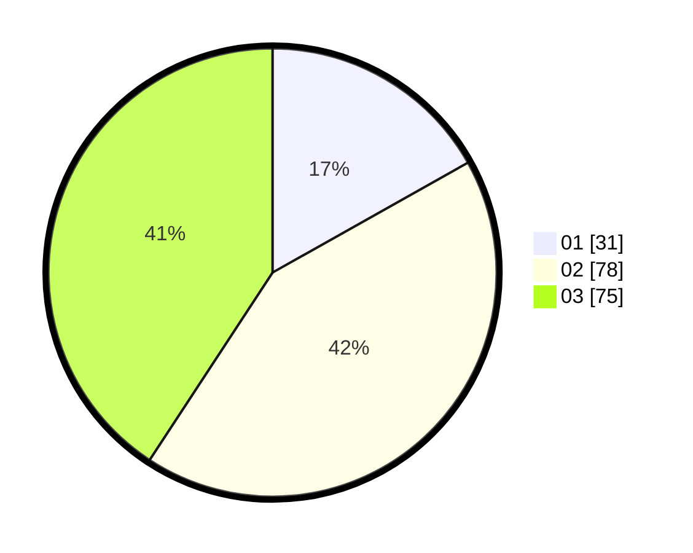

# Hasil

Hasil perolehan suara paslon dapat dilihat pada file paslon-01.txt, paslon-02.txt, dan paslon-03.txt.

Jika tidak ada, artinya data tersebut belum ada pada SIREKAP.

## Perolehan Suara

 * Paslon 01: **31**.
 * Paslon 02: **78**.
 * Paslon 03: **75**.

## Foto C Plano

https://sirekap-obj-formc.kpu.go.id/8626/pemilu/ppwp/31/71/01/10/06/3171011006002-20240216-031503--3e58ec69-7e31-45b7-b0fd-5fb395cf97fc.jpg

https://sirekap-obj-formc.kpu.go.id/8626/pemilu/ppwp/31/71/01/10/06/3171011006002-20240216-031515--30432779-99d9-4615-bbff-00f358e79942.jpg

https://sirekap-obj-formc.kpu.go.id/8626/pemilu/ppwp/31/71/01/10/06/3171011006002-20240216-031509--21f3fcd6-9b5c-40cf-a8c8-4c9a8b02c292.jpg

## DATA PEMILIH TETAP

Jumlah pemilih dalam DPT: **271**.
 * L: **140**.
 * P: **131**.

## DATA PENGGUNA HAK PILIH

Jumlah pengguna hak pilih dalam DPT: **170**.
 * L: **85**.
 * P: **85**.

Jumlah pengguna hak pilih dalam DPTb: **16**.
 * L: **6**.
 * P: **10**.

Jumlah pengguna hak pilih dalam DPK: **1**.
 * L: **1**.
 * P: **0**.

Jumlah pengguna hak pilih: **187**.
 * L: **92**.
 * P: **95**.

## JUMLAH SUARA SAH DAN TIDAK SAH

JUMLAH SELURUH SUARA SAH: **184**.

JUMLAH SUARA TIDAK SAH: **3**.

JUMLAH SELURUH SUARA SAH DAN SUARA TIDAK SAH: **187**.
