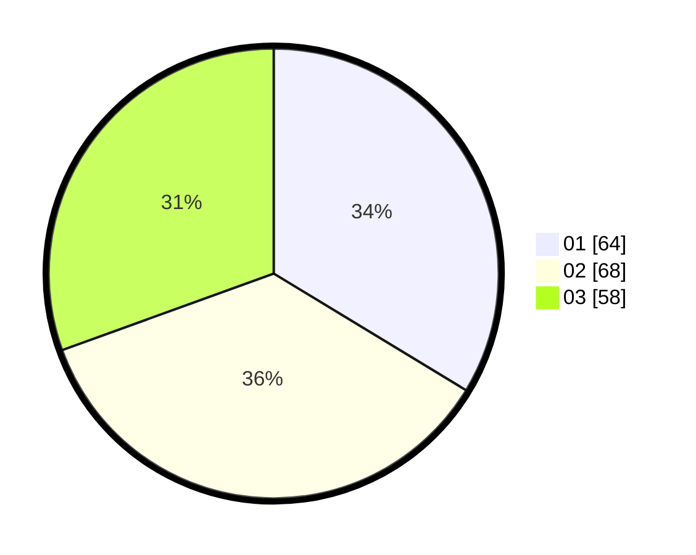

# Hasil

Hasil perolehan suara paslon dapat dilihat pada file paslon-01.txt, paslon-02.txt, dan paslon-03.txt.

Jika tidak ada, artinya data tersebut belum ada pada SIREKAP.

## Perolehan Suara

 * Paslon 01: **64**.
 * Paslon 02: **68**.
 * Paslon 03: **58**.

## Foto C Plano

https://sirekap-obj-formc.kpu.go.id/c03f/pemilu/ppwp/31/71/01/10/06/3171011006003-20240216-232531--5f50d1b6-b195-428c-a221-7d5ce8b1cfd1.jpg

https://sirekap-obj-formc.kpu.go.id/c03f/pemilu/ppwp/31/71/01/10/06/3171011006003-20240216-232532--897142bd-8af6-4024-9a9d-ed8d2224b8b4.jpg

https://sirekap-obj-formc.kpu.go.id/c03f/pemilu/ppwp/31/71/01/10/06/3171011006003-20240216-232532--300e8c48-211e-490d-8ddf-d5b10e7141b4.jpg

## DATA PEMILIH TETAP

Jumlah pemilih dalam DPT: **263**.
 * L: **127**.
 * P: **136**.

## DATA PENGGUNA HAK PILIH

Jumlah pengguna hak pilih dalam DPT: **185**.
 * L: **86**.
 * P: **99**.

Jumlah pengguna hak pilih dalam DPTb: **5**.
 * L: **2**.
 * P: **3**.

Jumlah pengguna hak pilih dalam DPK: **4**.
 * L: **1**.
 * P: **3**.

Jumlah pengguna hak pilih: **194**.
 * L: **89**.
 * P: **105**.

## JUMLAH SUARA SAH DAN TIDAK SAH

JUMLAH SELURUH SUARA SAH: **190**.

JUMLAH SUARA TIDAK SAH: **4**.

JUMLAH SELURUH SUARA SAH DAN SUARA TIDAK SAH: **194**.
