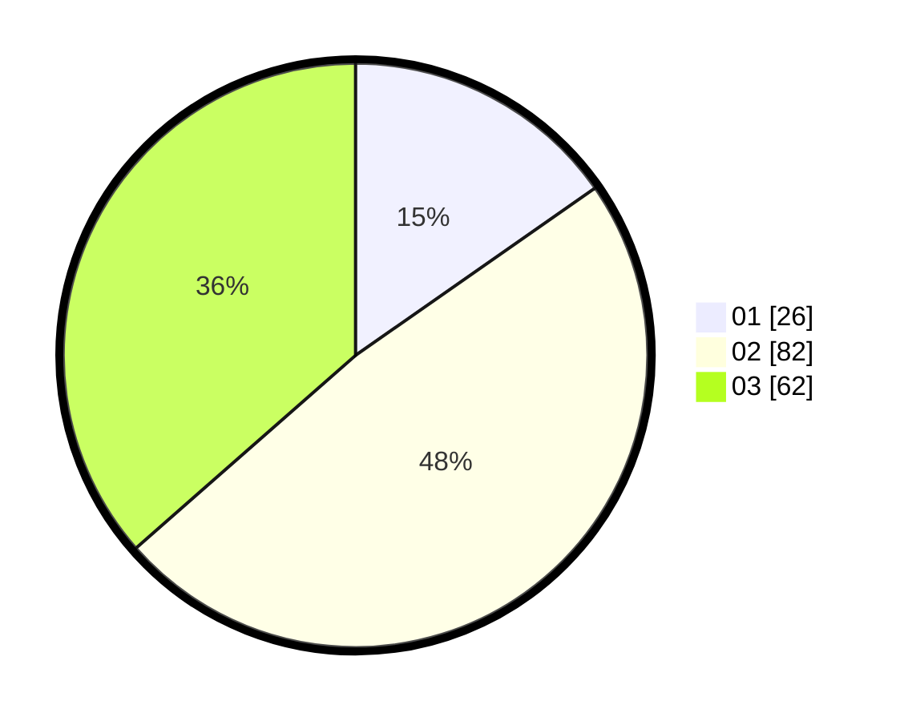

# Hasil

Hasil perolehan suara paslon dapat dilihat pada file paslon-01.txt, paslon-02.txt, dan paslon-03.txt.

Jika tidak ada, artinya data tersebut belum ada pada SIREKAP.

## Perolehan Suara

 * Paslon 01: **26**.
 * Paslon 02: **82**.
 * Paslon 03: **62**.

## Foto C Plano

https://sirekap-obj-formc.kpu.go.id/1c3d/pemilu/ppwp/31/71/01/10/06/3171011006004-20240215-212557--f346b4ab-3518-4f52-a604-cc45b3ea4b42.jpg

https://sirekap-obj-formc.kpu.go.id/1c3d/pemilu/ppwp/31/71/01/10/06/3171011006004-20240215-212559--c61d4b91-6115-47be-a17a-4de8521afb25.jpg

https://sirekap-obj-formc.kpu.go.id/1c3d/pemilu/ppwp/31/71/01/10/06/3171011006004-20240215-212558--224af13e-cb5c-4020-a1cc-710c3d2dc996.jpg

## DATA PEMILIH TETAP

Jumlah pemilih dalam DPT: **253**.
 * L: **119**.
 * P: **134**.

## DATA PENGGUNA HAK PILIH

Jumlah pengguna hak pilih dalam DPT: **169**.
 * L: **84**.
 * P: **85**.

Jumlah pengguna hak pilih dalam DPTb: **4**.
 * L: **3**.
 * P: **1**.

Jumlah pengguna hak pilih dalam DPK: **1**.
 * L: **0**.
 * P: **1**.

Jumlah pengguna hak pilih: **174**.
 * L: **87**.
 * P: **87**.

## JUMLAH SUARA SAH DAN TIDAK SAH

JUMLAH SELURUH SUARA SAH: **170**.

JUMLAH SUARA TIDAK SAH: **4**.

JUMLAH SELURUH SUARA SAH DAN SUARA TIDAK SAH: **174**.
