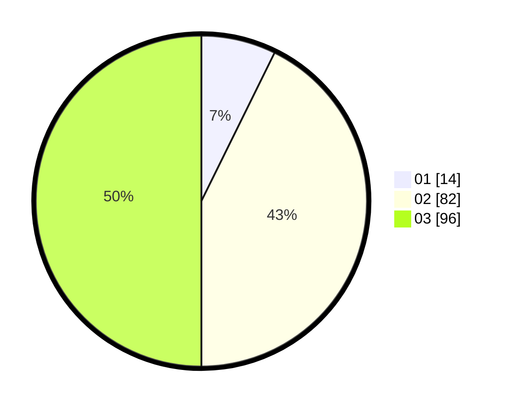

# Hasil

Hasil perolehan suara paslon dapat dilihat pada file paslon-01.txt, paslon-02.txt, dan paslon-03.txt.

Jika tidak ada, artinya data tersebut belum ada pada SIREKAP.

## Perolehan Suara

 * Paslon 01: **14**.
 * Paslon 02: **82**.
 * Paslon 03: **96**.

## Foto C Plano

https://sirekap-obj-formc.kpu.go.id/081c/pemilu/ppwp/31/71/01/10/06/3171011006005-20240215-003913--857b7a39-9447-4f3c-bb8d-c21d29891c65.jpg

https://sirekap-obj-formc.kpu.go.id/081c/pemilu/ppwp/31/71/01/10/06/3171011006005-20240215-003952--fb687764-92dc-4a81-85f7-6576de5462a4.jpg

https://sirekap-obj-formc.kpu.go.id/081c/pemilu/ppwp/31/71/01/10/06/3171011006005-20240215-023908--cad9f013-fd7d-4696-85c5-c2b9438c23de.jpg

## DATA PEMILIH TETAP

Jumlah pemilih dalam DPT: **263**.
 * L: **123**.
 * P: **140**.

## DATA PENGGUNA HAK PILIH

Jumlah pengguna hak pilih dalam DPT: **184**.
 * L: **94**.
 * P: **90**.

Jumlah pengguna hak pilih dalam DPTb: **6**.
 * L: **2**.
 * P: **4**.

Jumlah pengguna hak pilih dalam DPK: **0**.
 * L: **0**.
 * P: **0**.

Jumlah pengguna hak pilih: **190**.
 * L: **96**.
 * P: **94**.

## JUMLAH SUARA SAH DAN TIDAK SAH

JUMLAH SELURUH SUARA SAH: **192**.

JUMLAH SUARA TIDAK SAH: **3**.

JUMLAH SELURUH SUARA SAH DAN SUARA TIDAK SAH: **195**.
