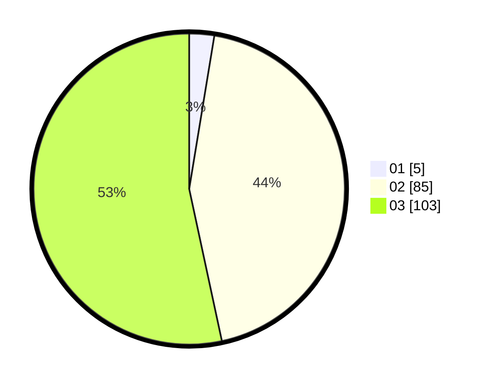

# Hasil

Hasil perolehan suara paslon dapat dilihat pada file paslon-01.txt, paslon-02.txt, dan paslon-03.txt.

Jika tidak ada, artinya data tersebut belum ada pada SIREKAP.

## Perolehan Suara

 * Paslon 01: **5**.
 * Paslon 02: **85**.
 * Paslon 03: **103**.

## Foto C Plano

https://sirekap-obj-formc.kpu.go.id/e1be/pemilu/ppwp/31/71/01/10/06/3171011006007-20240214-203455--dc89326b-4821-4973-a535-08c4418f8cc1.jpg

https://sirekap-obj-formc.kpu.go.id/e1be/pemilu/ppwp/31/71/01/10/06/3171011006007-20240214-203505--2b2e2900-eae1-4bbe-b32a-ba8ce93a1066.jpg

https://sirekap-obj-formc.kpu.go.id/e1be/pemilu/ppwp/31/71/01/10/06/3171011006007-20240214-203516--4fd591c7-e2fe-4ff0-95cb-f4d7d33257f8.jpg

## DATA PEMILIH TETAP

Jumlah pemilih dalam DPT: **254**.
 * L: **111**.
 * P: **143**.

## DATA PENGGUNA HAK PILIH

Jumlah pengguna hak pilih dalam DPT: **187**.
 * L: **85**.
 * P: **102**.

Jumlah pengguna hak pilih dalam DPTb: **2**.
 * L: **1**.
 * P: **1**.

Jumlah pengguna hak pilih dalam DPK: **5**.
 * L: **3**.
 * P: **2**.

Jumlah pengguna hak pilih: **194**.
 * L: **89**.
 * P: **105**.

## JUMLAH SUARA SAH DAN TIDAK SAH

JUMLAH SELURUH SUARA SAH: **193**.

JUMLAH SUARA TIDAK SAH: **1**.

JUMLAH SELURUH SUARA SAH DAN SUARA TIDAK SAH: **194**.
