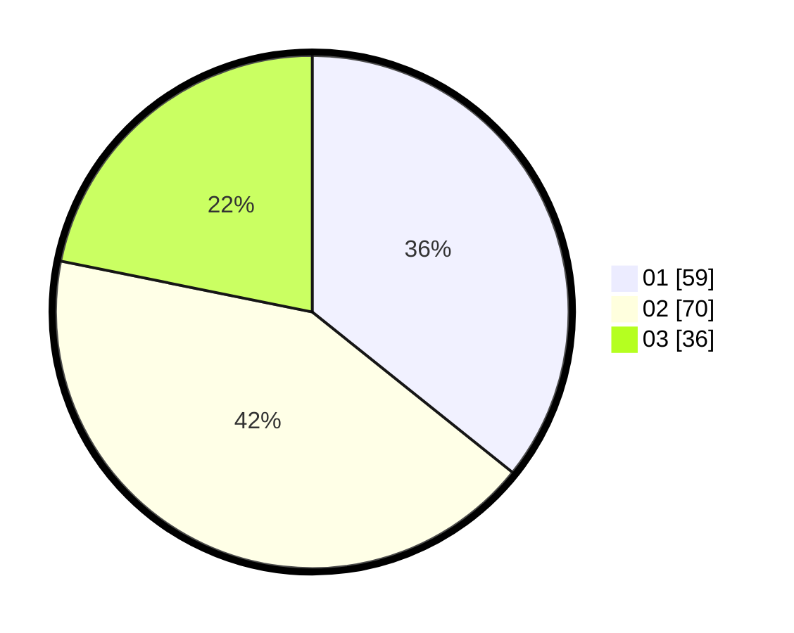

# Hasil

Hasil perolehan suara paslon dapat dilihat pada file paslon-01.txt, paslon-02.txt, dan paslon-03.txt.

Jika tidak ada, artinya data tersebut belum ada pada SIREKAP.

## Perolehan Suara

 * Paslon 01: **59**.
 * Paslon 02: **70**.
 * Paslon 03: **36**.

## Foto C Plano

https://sirekap-obj-formc.kpu.go.id/55f1/pemilu/ppwp/31/71/01/10/06/3171011006011-20240215-003906--f029e106-6e94-4d2c-9843-00eb5578d7ed.jpg

https://sirekap-obj-formc.kpu.go.id/55f1/pemilu/ppwp/31/71/01/10/06/3171011006011-20240214-204842--5b12e1cd-faaa-444e-a29d-97092200a9ec.jpg

https://sirekap-obj-formc.kpu.go.id/55f1/pemilu/ppwp/31/71/01/10/06/3171011006011-20240215-003646--1feab4c5-1019-4a61-8187-324965be7306.jpg
