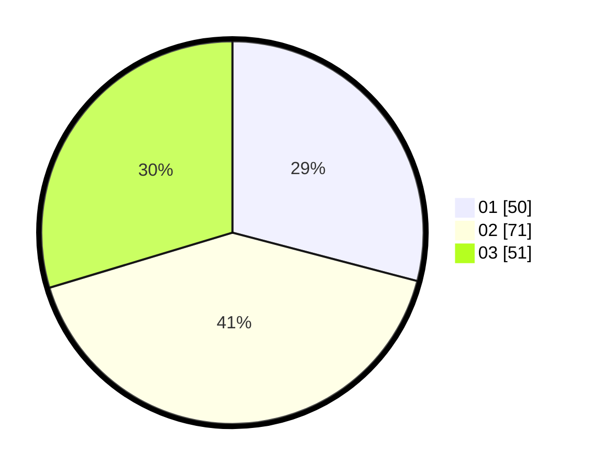

# Hasil

Hasil perolehan suara paslon dapat dilihat pada file paslon-01.txt, paslon-02.txt, dan paslon-03.txt.

Jika tidak ada, artinya data tersebut belum ada pada SIREKAP.

## Perolehan Suara

 * Paslon 01: **50**.
 * Paslon 02: **71**.
 * Paslon 03: **51**.

## Foto C Plano

https://sirekap-obj-formc.kpu.go.id/10d8/pemilu/ppwp/31/71/01/10/06/3171011006012-20240214-175447--fea40db3-ef2b-4dd6-83d1-4b79c0bf230a.jpg

https://sirekap-obj-formc.kpu.go.id/10d8/pemilu/ppwp/31/71/01/10/06/3171011006012-20240214-191623--3582a602-1749-4106-95de-388a2b80ff2f.jpg

https://sirekap-obj-formc.kpu.go.id/10d8/pemilu/ppwp/31/71/01/10/06/3171011006012-20240215-210343--3882dd10-153e-42f3-91e7-945611f801bb.jpg

## DATA PEMILIH TETAP

Jumlah pemilih dalam DPT: **253**.
 * L: **124**.
 * P: **129**.

## DATA PENGGUNA HAK PILIH

Jumlah pengguna hak pilih dalam DPT: **171**.
 * L: **80**.
 * P: **91**.

Jumlah pengguna hak pilih dalam DPTb: **2**.
 * L: **0**.
 * P: **2**.

Jumlah pengguna hak pilih dalam DPK: **1**.
 * L: **0**.
 * P: **1**.

Jumlah pengguna hak pilih: **174**.
 * L: **80**.
 * P: **94**.

## JUMLAH SUARA SAH DAN TIDAK SAH

JUMLAH SELURUH SUARA SAH: **172**.

JUMLAH SUARA TIDAK SAH: **2**.

JUMLAH SELURUH SUARA SAH DAN SUARA TIDAK SAH: **174**.
