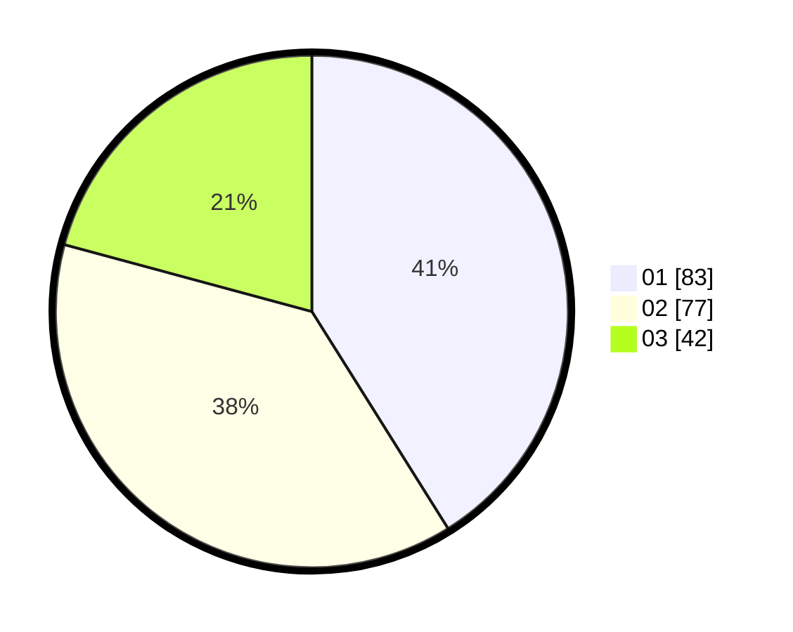

# Hasil

Hasil perolehan suara paslon dapat dilihat pada file paslon-01.txt, paslon-02.txt, dan paslon-03.txt.

Jika tidak ada, artinya data tersebut belum ada pada SIREKAP.

## Perolehan Suara

 * Paslon 01: **83**.
 * Paslon 02: **77**.
 * Paslon 03: **42**.

## Foto C Plano

https://sirekap-obj-formc.kpu.go.id/d127/pemilu/ppwp/31/71/01/10/06/3171011006015-20240214-192553--deda428b-5c5d-4a7e-a2e1-903c79a22f0f.jpg

https://sirekap-obj-formc.kpu.go.id/d127/pemilu/ppwp/31/71/01/10/06/3171011006015-20240215-010822--8b29ba6d-f9e1-48ac-b43b-80f97f5e7e54.jpg

https://sirekap-obj-formc.kpu.go.id/d127/pemilu/ppwp/31/71/01/10/06/3171011006015-20240214-195231--3d225826-d4eb-4ed5-ac46-002425f23fff.jpg

## DATA PEMILIH TETAP

Jumlah pemilih dalam DPT: **268**.
 * L: **128**.
 * P: **140**.

## DATA PENGGUNA HAK PILIH

Jumlah pengguna hak pilih dalam DPT: **203**.
 * L: **93**.
 * P: **110**.

Jumlah pengguna hak pilih dalam DPTb: **0**.
 * L: **0**.
 * P: **0**.

Jumlah pengguna hak pilih dalam DPK: **3**.
 * L: **3**.
 * P: **0**.

Jumlah pengguna hak pilih: **206**.
 * L: **96**.
 * P: **110**.

## JUMLAH SUARA SAH DAN TIDAK SAH

JUMLAH SELURUH SUARA SAH: **202**.

JUMLAH SUARA TIDAK SAH: **4**.

JUMLAH SELURUH SUARA SAH DAN SUARA TIDAK SAH: **206**.
