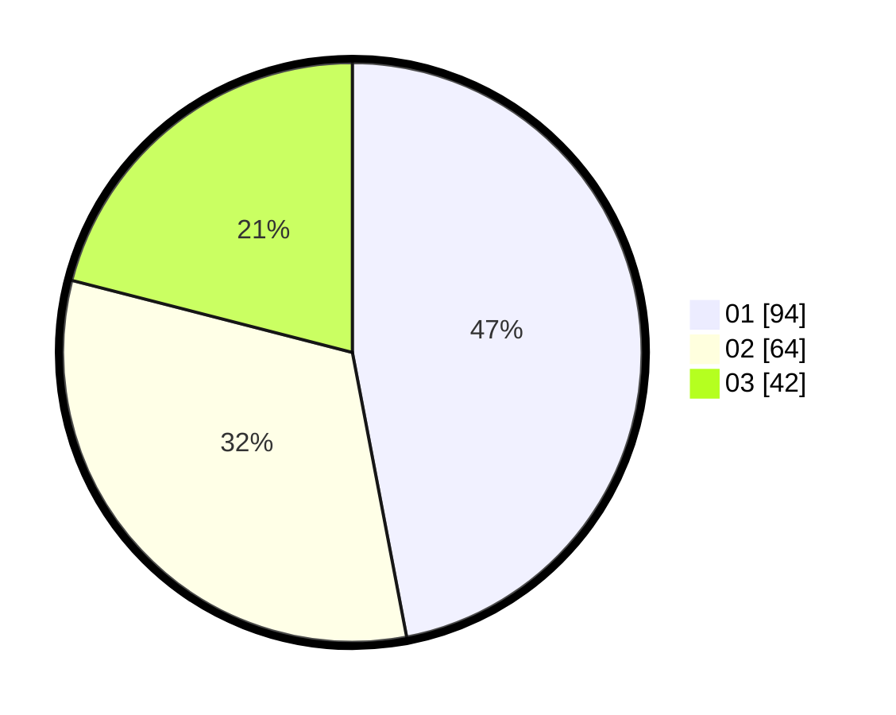

# Hasil

Hasil perolehan suara paslon dapat dilihat pada file paslon-01.txt, paslon-02.txt, dan paslon-03.txt.

Jika tidak ada, artinya data tersebut belum ada pada SIREKAP.

## Perolehan Suara

 * Paslon 01: **94**.
 * Paslon 02: **64**.
 * Paslon 03: **42**.

## Foto C Plano

https://sirekap-obj-formc.kpu.go.id/3227/pemilu/ppwp/31/71/01/10/06/3171011006016-20240214-185106--de93d661-7202-405a-8f79-b5febad177af.jpg

https://sirekap-obj-formc.kpu.go.id/3227/pemilu/ppwp/31/71/01/10/06/3171011006016-20240214-185851--264846c0-28e7-47de-ac66-8740840316d7.jpg

https://sirekap-obj-formc.kpu.go.id/3227/pemilu/ppwp/31/71/01/10/06/3171011006016-20240214-185137--547a750c-fdc2-4aea-b5cf-0c5e37edffdf.jpg

## DATA PEMILIH TETAP

Jumlah pemilih dalam DPT: **268**.
 * L: **137**.
 * P: **131**.

## DATA PENGGUNA HAK PILIH

Jumlah pengguna hak pilih dalam DPT: **200**.
 * L: **102**.
 * P: **98**.

Jumlah pengguna hak pilih dalam DPTb: **0**.
 * L: **0**.
 * P: **0**.

Jumlah pengguna hak pilih dalam DPK: **1**.
 * L: **0**.
 * P: **1**.

Jumlah pengguna hak pilih: **201**.
 * L: **102**.
 * P: **99**.

## JUMLAH SUARA SAH DAN TIDAK SAH

JUMLAH SELURUH SUARA SAH: **200**.

JUMLAH SUARA TIDAK SAH: **1**.

JUMLAH SELURUH SUARA SAH DAN SUARA TIDAK SAH: **201**.
