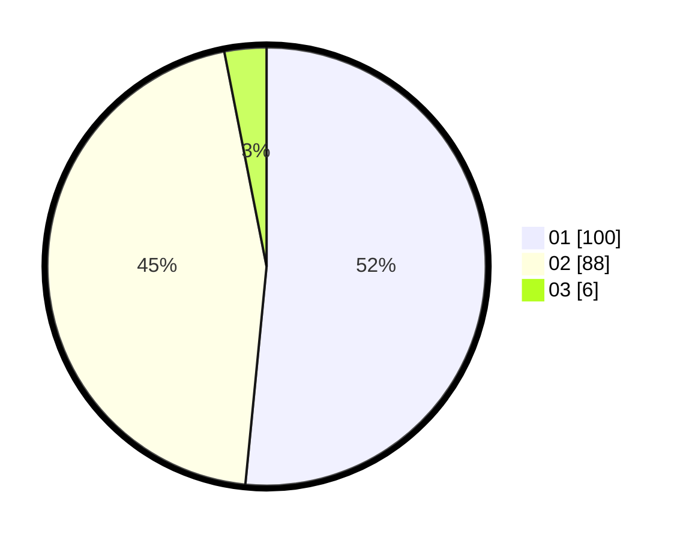

# Hasil

Hasil perolehan suara paslon dapat dilihat pada file paslon-01.txt, paslon-02.txt, dan paslon-03.txt.

Jika tidak ada, artinya data tersebut belum ada pada SIREKAP.

## Perolehan Suara

 * Paslon 01: **100**.
 * Paslon 02: **88**.
 * Paslon 03: **6**.

## Foto C Plano

https://sirekap-obj-formc.kpu.go.id/8aa8/pemilu/ppwp/31/71/01/10/06/3171011006025-20240214-192009--c26f9467-ffc7-4fb9-a058-32ce73c7d44b.jpg

https://sirekap-obj-formc.kpu.go.id/8aa8/pemilu/ppwp/31/71/01/10/06/3171011006025-20240214-190502--29f84aa7-76c0-4f3c-bc04-b81c8f1ce3dc.jpg

https://sirekap-obj-formc.kpu.go.id/8aa8/pemilu/ppwp/31/71/01/10/06/3171011006025-20240214-190608--66077981-4a17-4c82-b0d0-e78227f03c13.jpg

## DATA PEMILIH TETAP

Jumlah pemilih dalam DPT: **260**.
 * L: **132**.
 * P: **178**.

## DATA PENGGUNA HAK PILIH

Jumlah pengguna hak pilih dalam DPT: **193**.
 * L: **92**.
 * P: **101**.

Jumlah pengguna hak pilih dalam DPTb: **1**.
 * L: **1**.
 * P: **0**.

Jumlah pengguna hak pilih dalam DPK: **1**.
 * L: **1**.
 * P: **0**.

Jumlah pengguna hak pilih: **195**.
 * L: **94**.
 * P: **101**.

## JUMLAH SUARA SAH DAN TIDAK SAH

JUMLAH SELURUH SUARA SAH: **194**.

JUMLAH SUARA TIDAK SAH: **1**.

JUMLAH SELURUH SUARA SAH DAN SUARA TIDAK SAH: **195**.
