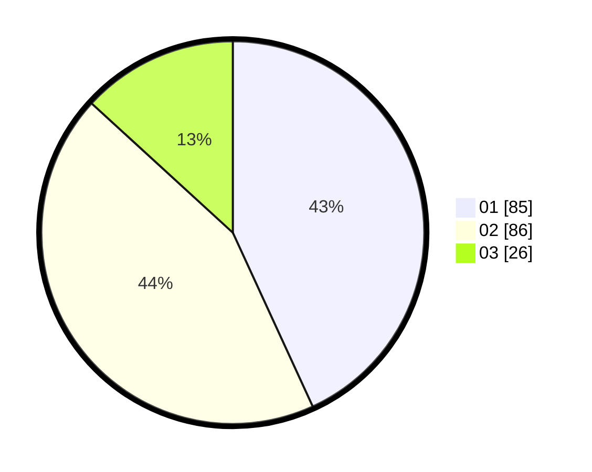

# Hasil

Hasil perolehan suara paslon dapat dilihat pada file paslon-01.txt, paslon-02.txt, dan paslon-03.txt.

Jika tidak ada, artinya data tersebut belum ada pada SIREKAP.

## Perolehan Suara

 * Paslon 01: **85**.
 * Paslon 02: **86**.
 * Paslon 03: **26**.

## Foto C Plano

https://sirekap-obj-formc.kpu.go.id/ad0d/pemilu/ppwp/31/71/01/10/06/3171011006027-20240214-201143--163e74d0-1f91-4f9d-9f0c-26dc785074eb.jpg

https://sirekap-obj-formc.kpu.go.id/ad0d/pemilu/ppwp/31/71/01/10/06/3171011006027-20240214-233443--da9e3910-fa38-46a0-866a-14a0fbd876af.jpg

https://sirekap-obj-formc.kpu.go.id/ad0d/pemilu/ppwp/31/71/01/10/06/3171011006027-20240214-204131--8e59c8d4-f529-498a-8164-c7f57600a40e.jpg

## DATA PEMILIH TETAP

Jumlah pemilih dalam DPT: **267**.
 * L: **128**.
 * P: **139**.

## DATA PENGGUNA HAK PILIH

Jumlah pengguna hak pilih dalam DPT: **193**.
 * L: **86**.
 * P: **107**.

Jumlah pengguna hak pilih dalam DPTb: **5**.
 * L: **0**.
 * P: **5**.

Jumlah pengguna hak pilih dalam DPK: **2**.
 * L: **1**.
 * P: **1**.

Jumlah pengguna hak pilih: **200**.
 * L: **87**.
 * P: **113**.

## JUMLAH SUARA SAH DAN TIDAK SAH

JUMLAH SELURUH SUARA SAH: **197**.

JUMLAH SUARA TIDAK SAH: **3**.

JUMLAH SELURUH SUARA SAH DAN SUARA TIDAK SAH: **200**.
