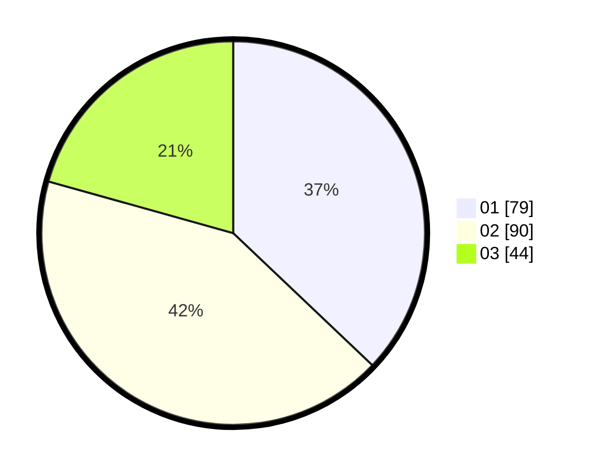

# Hasil

Hasil perolehan suara paslon dapat dilihat pada file paslon-01.txt, paslon-02.txt, dan paslon-03.txt.

Jika tidak ada, artinya data tersebut belum ada pada SIREKAP.

## Perolehan Suara

 * Paslon 01: **79**.
 * Paslon 02: **90**.
 * Paslon 03: **44**.

## Foto C Plano

https://sirekap-obj-formc.kpu.go.id/bd3a/pemilu/ppwp/31/71/01/10/06/3171011006028-20240214-192904--95bc394c-6cc2-4fea-9c71-3a1811ab3be1.jpg

https://sirekap-obj-formc.kpu.go.id/bd3a/pemilu/ppwp/31/71/01/10/06/3171011006028-20240214-195310--661f9c9b-1f33-43ea-b172-b82ee8010657.jpg

https://sirekap-obj-formc.kpu.go.id/bd3a/pemilu/ppwp/31/71/01/10/06/3171011006028-20240214-192947--ab993bab-b715-45bb-8036-0168ab225f52.jpg

## DATA PEMILIH TETAP

Jumlah pemilih dalam DPT: **262**.
 * L: **132**.
 * P: **130**.

## DATA PENGGUNA HAK PILIH

Jumlah pengguna hak pilih dalam DPT: **214**.
 * L: **102**.
 * P: **112**.

Jumlah pengguna hak pilih dalam DPTb: **1**.
 * L: **0**.
 * P: **1**.

Jumlah pengguna hak pilih dalam DPK: **1**.
 * L: **1**.
 * P: **0**.

Jumlah pengguna hak pilih: **216**.
 * L: **103**.
 * P: **113**.

## JUMLAH SUARA SAH DAN TIDAK SAH

JUMLAH SELURUH SUARA SAH: **213**.

JUMLAH SUARA TIDAK SAH: **3**.

JUMLAH SELURUH SUARA SAH DAN SUARA TIDAK SAH: **216**.
