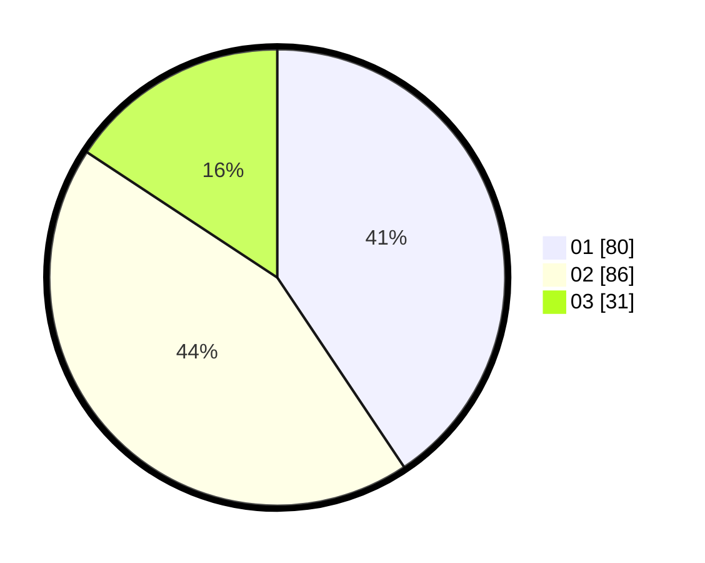

# Hasil

Hasil perolehan suara paslon dapat dilihat pada file paslon-01.txt, paslon-02.txt, dan paslon-03.txt.

Jika tidak ada, artinya data tersebut belum ada pada SIREKAP.

## Perolehan Suara

 * Paslon 01: **80**.
 * Paslon 02: **86**.
 * Paslon 03: **31**.

## Foto C Plano

https://sirekap-obj-formc.kpu.go.id/6362/pemilu/ppwp/31/71/01/10/06/3171011006029-20240215-013511--0f6a2529-79e6-47f3-b4a3-350b77da62c6.jpg

https://sirekap-obj-formc.kpu.go.id/6362/pemilu/ppwp/31/71/01/10/06/3171011006029-20240215-013939--046d3d4b-87d0-410e-9ddb-f59465a95e7f.jpg

https://sirekap-obj-formc.kpu.go.id/6362/pemilu/ppwp/31/71/01/10/06/3171011006029-20240215-014019--17abe39a-8cff-40f8-9255-efb934eb39d5.jpg

## DATA PEMILIH TETAP

Jumlah pemilih dalam DPT: **264**.
 * L: **136**.
 * P: **128**.

## DATA PENGGUNA HAK PILIH

Jumlah pengguna hak pilih dalam DPT: **200**.
 * L: **99**.
 * P: **101**.

Jumlah pengguna hak pilih dalam DPTb: **0**.
 * L: **0**.
 * P: **0**.

Jumlah pengguna hak pilih dalam DPK: **0**.
 * L: **0**.
 * P: **0**.

Jumlah pengguna hak pilih: **200**.
 * L: **99**.
 * P: **101**.

## JUMLAH SUARA SAH DAN TIDAK SAH

JUMLAH SELURUH SUARA SAH: **197**.

JUMLAH SUARA TIDAK SAH: **3**.

JUMLAH SELURUH SUARA SAH DAN SUARA TIDAK SAH: **200**.
