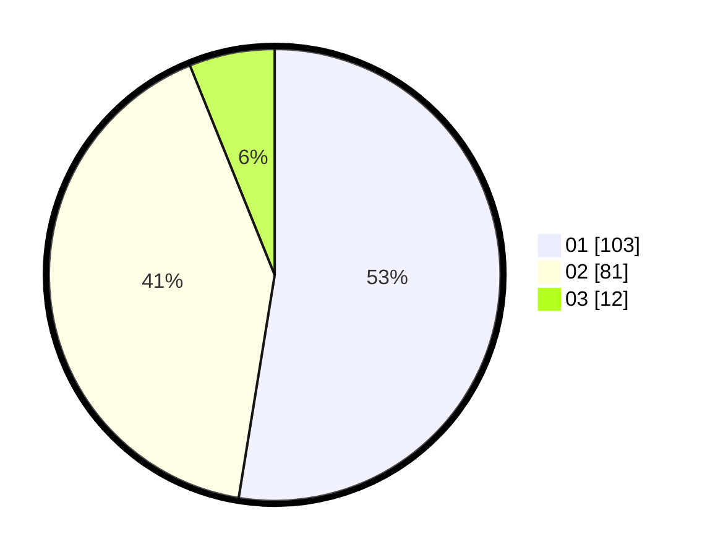

# Hasil

Hasil perolehan suara paslon dapat dilihat pada file paslon-01.txt, paslon-02.txt, dan paslon-03.txt.

Jika tidak ada, artinya data tersebut belum ada pada SIREKAP.

## Perolehan Suara

 * Paslon 01: **103**.
 * Paslon 02: **81**.
 * Paslon 03: **12**.

## Foto C Plano

https://sirekap-obj-formc.kpu.go.id/218c/pemilu/ppwp/31/71/01/10/06/3171011006035-20240214-194037--36f7626a-118a-43eb-b3fa-a2f22253ce4d.jpg

https://sirekap-obj-formc.kpu.go.id/218c/pemilu/ppwp/31/71/01/10/06/3171011006035-20240214-194018--11723f96-bd80-4437-9453-b1e2e534adf4.jpg

https://sirekap-obj-formc.kpu.go.id/218c/pemilu/ppwp/31/71/01/10/06/3171011006035-20240214-194315--d2d18790-4b68-4c74-8f4c-9640305634f9.jpg

## DATA PEMILIH TETAP

Jumlah pemilih dalam DPT: **229**.
 * L: **124**.
 * P: **105**.

## DATA PENGGUNA HAK PILIH

Jumlah pengguna hak pilih dalam DPT: **191**.
 * L: **106**.
 * P: **85**.

Jumlah pengguna hak pilih dalam DPTb: **0**.
 * L: **0**.
 * P: **0**.

Jumlah pengguna hak pilih dalam DPK: **5**.
 * L: **4**.
 * P: **1**.

Jumlah pengguna hak pilih: **196**.
 * L: **110**.
 * P: **86**.

## JUMLAH SUARA SAH DAN TIDAK SAH

JUMLAH SELURUH SUARA SAH: **196**.

JUMLAH SUARA TIDAK SAH: **0**.

JUMLAH SELURUH SUARA SAH DAN SUARA TIDAK SAH: **196**.
