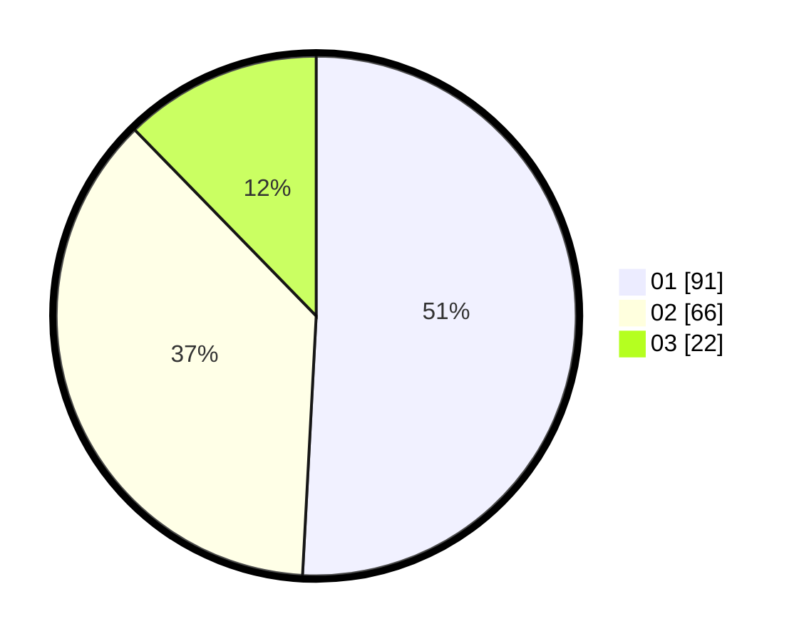

# Hasil

Hasil perolehan suara paslon dapat dilihat pada file paslon-01.txt, paslon-02.txt, dan paslon-03.txt.

Jika tidak ada, artinya data tersebut belum ada pada SIREKAP.

## Perolehan Suara

 * Paslon 01: **91**.
 * Paslon 02: **66**.
 * Paslon 03: **22**.

## Foto C Plano

https://sirekap-obj-formc.kpu.go.id/be7f/pemilu/ppwp/31/71/01/10/06/3171011006036-20240215-121908--111473ac-789a-45e9-8659-7ad6445ce0b2.jpg

https://sirekap-obj-formc.kpu.go.id/be7f/pemilu/ppwp/31/71/01/10/06/3171011006036-20240214-192750--dfeb023f-8598-48d8-9ce9-51b0a3203f20.jpg

https://sirekap-obj-formc.kpu.go.id/be7f/pemilu/ppwp/31/71/01/10/06/3171011006036-20240215-121918--bdaab2d8-ea0f-4bd6-ac45-7537d14bec68.jpg

## DATA PEMILIH TETAP

Jumlah pemilih dalam DPT: **261**.
 * L: **128**.
 * P: **133**.

## DATA PENGGUNA HAK PILIH

Jumlah pengguna hak pilih dalam DPT: **175**.
 * L: **81**.
 * P: **94**.

Jumlah pengguna hak pilih dalam DPTb: **5**.
 * L: **1**.
 * P: **4**.

Jumlah pengguna hak pilih dalam DPK: **0**.
 * L: **0**.
 * P: **0**.

Jumlah pengguna hak pilih: **180**.
 * L: **82**.
 * P: **98**.

## JUMLAH SUARA SAH DAN TIDAK SAH

JUMLAH SELURUH SUARA SAH: **179**.

JUMLAH SUARA TIDAK SAH: **1**.

JUMLAH SELURUH SUARA SAH DAN SUARA TIDAK SAH: **180**.
