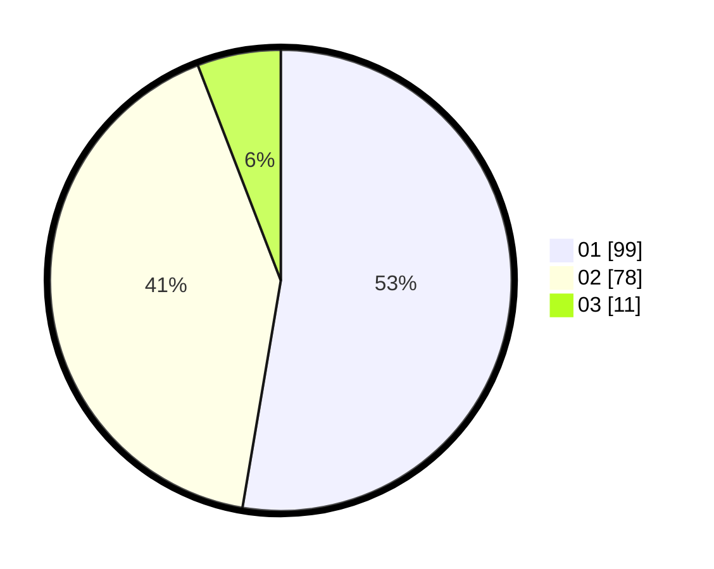

# Hasil

Hasil perolehan suara paslon dapat dilihat pada file paslon-01.txt, paslon-02.txt, dan paslon-03.txt.

Jika tidak ada, artinya data tersebut belum ada pada SIREKAP.

## Perolehan Suara

 * Paslon 01: **99**.
 * Paslon 02: **78**.
 * Paslon 03: **11**.

## Foto C Plano

https://sirekap-obj-formc.kpu.go.id/6ec1/pemilu/ppwp/31/71/01/10/06/3171011006037-20240214-202134--d0e5773f-8cfe-4b9a-a8fc-0204a0d0e2c6.jpg

https://sirekap-obj-formc.kpu.go.id/6ec1/pemilu/ppwp/31/71/01/10/06/3171011006037-20240214-202533--68aae024-1334-4b60-b015-1c3d05e2d1ad.jpg

https://sirekap-obj-formc.kpu.go.id/6ec1/pemilu/ppwp/31/71/01/10/06/3171011006037-20240214-202855--704d7cbb-a531-4a09-8633-c5fae564b55b.jpg

## DATA PEMILIH TETAP

Jumlah pemilih dalam DPT: **265**.
 * L: **129**.
 * P: **136**.

## DATA PENGGUNA HAK PILIH

Jumlah pengguna hak pilih dalam DPT: **192**.
 * L: **87**.
 * P: **105**.

Jumlah pengguna hak pilih dalam DPTb: **0**.
 * L: **0**.
 * P: **0**.

Jumlah pengguna hak pilih dalam DPK: **0**.
 * L: **0**.
 * P: **0**.

Jumlah pengguna hak pilih: **192**.
 * L: **87**.
 * P: **105**.

## JUMLAH SUARA SAH DAN TIDAK SAH

JUMLAH SELURUH SUARA SAH: **188**.

JUMLAH SUARA TIDAK SAH: **4**.

JUMLAH SELURUH SUARA SAH DAN SUARA TIDAK SAH: **192**.
