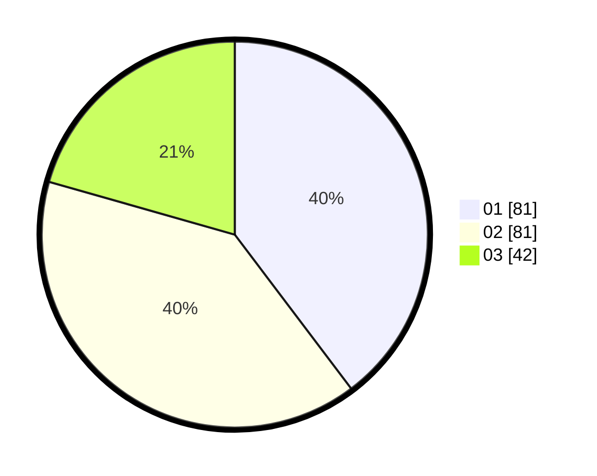

# Hasil

Hasil perolehan suara paslon dapat dilihat pada file paslon-01.txt, paslon-02.txt, dan paslon-03.txt.

Jika tidak ada, artinya data tersebut belum ada pada SIREKAP.

## Perolehan Suara

 * Paslon 01: **81**.
 * Paslon 02: **81**.
 * Paslon 03: **42**.

## Foto C Plano

https://sirekap-obj-formc.kpu.go.id/a92b/pemilu/ppwp/31/71/01/10/06/3171011006039-20240216-145440--cb2f51ab-21eb-45da-8eaf-2fc062d6bd48.jpg

https://sirekap-obj-formc.kpu.go.id/a92b/pemilu/ppwp/31/71/01/10/06/3171011006039-20240216-145441--5f590b88-6c7c-41c0-8e9a-0197d17ead94.jpg

https://sirekap-obj-formc.kpu.go.id/a92b/pemilu/ppwp/31/71/01/10/06/3171011006039-20240216-145440--c26fcb9f-4974-4db2-a5d4-eec0d85f884e.jpg

## DATA PEMILIH TETAP

Jumlah pemilih dalam DPT: **269**.
 * L: **133**.
 * P: **136**.

## DATA PENGGUNA HAK PILIH

Jumlah pengguna hak pilih dalam DPT: **211**.
 * L: **99**.
 * P: **112**.

Jumlah pengguna hak pilih dalam DPTb: **0**.
 * L: **0**.
 * P: **0**.

Jumlah pengguna hak pilih dalam DPK: **0**.
 * L: **0**.
 * P: **0**.

Jumlah pengguna hak pilih: **211**.
 * L: **99**.
 * P: **112**.

## JUMLAH SUARA SAH DAN TIDAK SAH

JUMLAH SELURUH SUARA SAH: **204**.

JUMLAH SUARA TIDAK SAH: **7**.

JUMLAH SELURUH SUARA SAH DAN SUARA TIDAK SAH: **211**.
