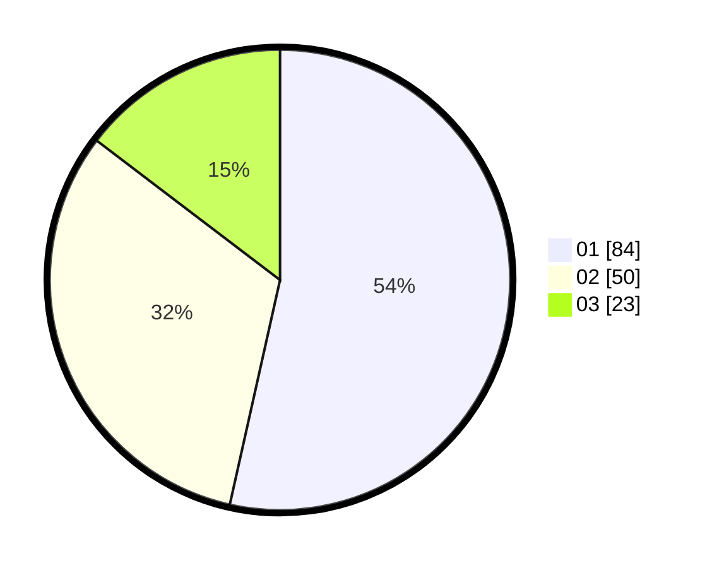

# Hasil

Hasil perolehan suara paslon dapat dilihat pada file paslon-01.txt, paslon-02.txt, dan paslon-03.txt.

Jika tidak ada, artinya data tersebut belum ada pada SIREKAP.

## Perolehan Suara

 * Paslon 01: **84**.
 * Paslon 02: **50**.
 * Paslon 03: **23**.

## Foto C Plano

https://sirekap-obj-formc.kpu.go.id/0299/pemilu/ppwp/31/71/01/10/06/3171011006047-20240216-025720--cbed0bbe-8a73-4371-a1a7-8baf187234fa.jpg

https://sirekap-obj-formc.kpu.go.id/0299/pemilu/ppwp/31/71/01/10/06/3171011006047-20240216-025722--d4fb5020-023b-4dea-8794-ddc26ec35c32.jpg

https://sirekap-obj-formc.kpu.go.id/0299/pemilu/ppwp/31/71/01/10/06/3171011006047-20240216-025721--f283b68b-f7ac-43fd-a573-2089915864f4.jpg

## DATA PEMILIH TETAP

Jumlah pemilih dalam DPT: **226**.
 * L: **119**.
 * P: **107**.

## DATA PENGGUNA HAK PILIH

Jumlah pengguna hak pilih dalam DPT: **160**.
 * L: **79**.
 * P: **81**.

Jumlah pengguna hak pilih dalam DPTb: **0**.
 * L: **0**.
 * P: **0**.

Jumlah pengguna hak pilih dalam DPK: **1**.
 * L: **1**.
 * P: **0**.

Jumlah pengguna hak pilih: **161**.
 * L: **80**.
 * P: **81**.

## JUMLAH SUARA SAH DAN TIDAK SAH

JUMLAH SELURUH SUARA SAH: **157**.

JUMLAH SUARA TIDAK SAH: **4**.

JUMLAH SELURUH SUARA SAH DAN SUARA TIDAK SAH: **161**.
