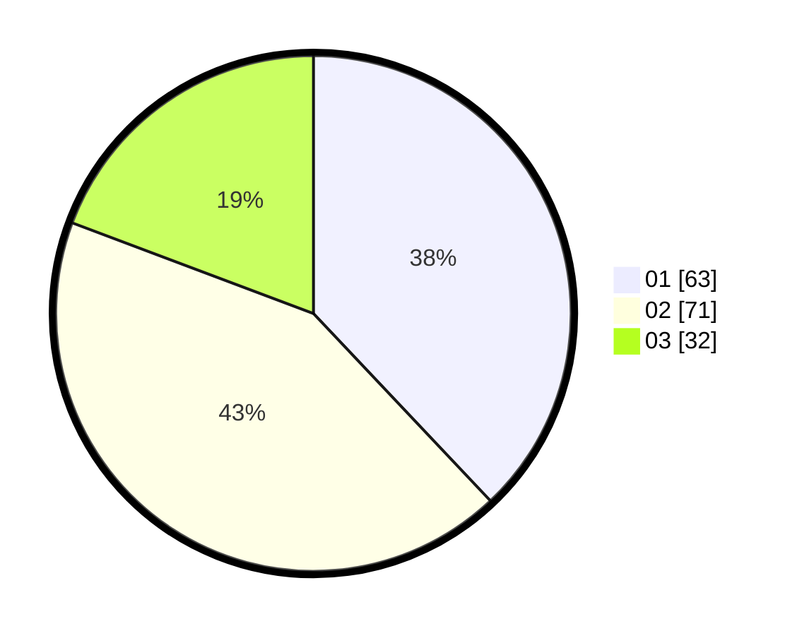

# Hasil

Hasil perolehan suara paslon dapat dilihat pada file paslon-01.txt, paslon-02.txt, dan paslon-03.txt.

Jika tidak ada, artinya data tersebut belum ada pada SIREKAP.

## Perolehan Suara

 * Paslon 01: **63**.
 * Paslon 02: **71**.
 * Paslon 03: **32**.

## Foto C Plano

https://sirekap-obj-formc.kpu.go.id/4064/pemilu/ppwp/31/71/01/10/06/3171011006048-20240216-140632--6c2c2f8a-b9a0-4b16-854f-ea8497838298.jpg

https://sirekap-obj-formc.kpu.go.id/4064/pemilu/ppwp/31/71/01/10/06/3171011006048-20240216-140634--7bc54763-c8ee-4c4f-adef-2ba00d77ee9e.jpg

https://sirekap-obj-formc.kpu.go.id/4064/pemilu/ppwp/31/71/01/10/06/3171011006048-20240216-140633--8e543041-38a8-4448-b882-2476cea2346a.jpg

## DATA PEMILIH TETAP

Jumlah pemilih dalam DPT: **223**.
 * L: **111**.
 * P: **112**.

## DATA PENGGUNA HAK PILIH

Jumlah pengguna hak pilih dalam DPT: **164**.
 * L: **82**.
 * P: **82**.

Jumlah pengguna hak pilih dalam DPTb: **0**.
 * L: **0**.
 * P: **0**.

Jumlah pengguna hak pilih dalam DPK: **4**.
 * L: **2**.
 * P: **2**.

Jumlah pengguna hak pilih: **168**.
 * L: **84**.
 * P: **84**.

## JUMLAH SUARA SAH DAN TIDAK SAH

JUMLAH SELURUH SUARA SAH: **166**.

JUMLAH SUARA TIDAK SAH: **2**.

JUMLAH SELURUH SUARA SAH DAN SUARA TIDAK SAH: **168**.
