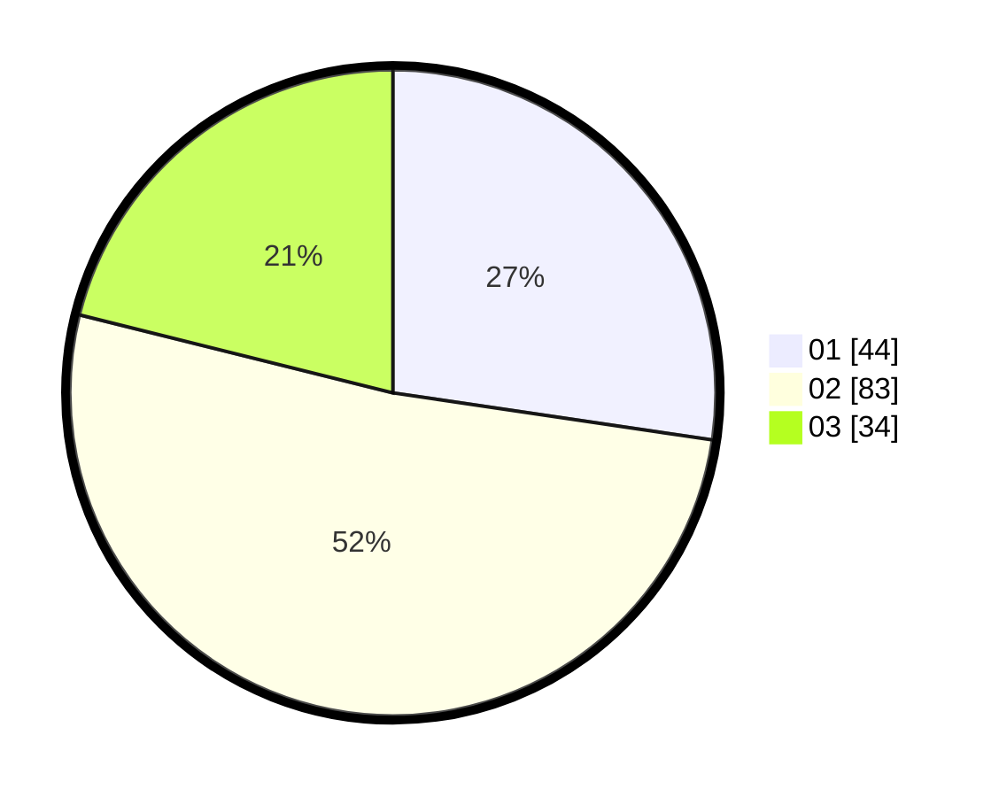

# Hasil

Hasil perolehan suara paslon dapat dilihat pada file paslon-01.txt, paslon-02.txt, dan paslon-03.txt.

Jika tidak ada, artinya data tersebut belum ada pada SIREKAP.

## Perolehan Suara

 * Paslon 01: **44**.
 * Paslon 02: **83**.
 * Paslon 03: **34**.

## Foto C Plano

https://sirekap-obj-formc.kpu.go.id/f44c/pemilu/ppwp/31/71/01/10/06/3171011006049-20240214-214234--c9d68ce2-1f2b-4d5f-b01e-ee27ba90e3bc.jpg

https://sirekap-obj-formc.kpu.go.id/f44c/pemilu/ppwp/31/71/01/10/06/3171011006049-20240214-214348--4a8d7e20-1ef5-4e73-8492-8946630bfbbe.jpg

https://sirekap-obj-formc.kpu.go.id/f44c/pemilu/ppwp/31/71/01/10/06/3171011006049-20240214-214457--c1569cf8-7535-4e34-9631-599cefa74f77.jpg

## DATA PEMILIH TETAP

Jumlah pemilih dalam DPT: **217**.
 * L: **111**.
 * P: **106**.

## DATA PENGGUNA HAK PILIH

Jumlah pengguna hak pilih dalam DPT: **164**.
 * L: **83**.
 * P: **81**.

Jumlah pengguna hak pilih dalam DPTb: **0**.
 * L: **0**.
 * P: **0**.

Jumlah pengguna hak pilih dalam DPK: **0**.
 * L: **0**.
 * P: **0**.

Jumlah pengguna hak pilih: **164**.
 * L: **83**.
 * P: **81**.

## JUMLAH SUARA SAH DAN TIDAK SAH

JUMLAH SELURUH SUARA SAH: **161**.

JUMLAH SUARA TIDAK SAH: **3**.

JUMLAH SELURUH SUARA SAH DAN SUARA TIDAK SAH: **164**.
