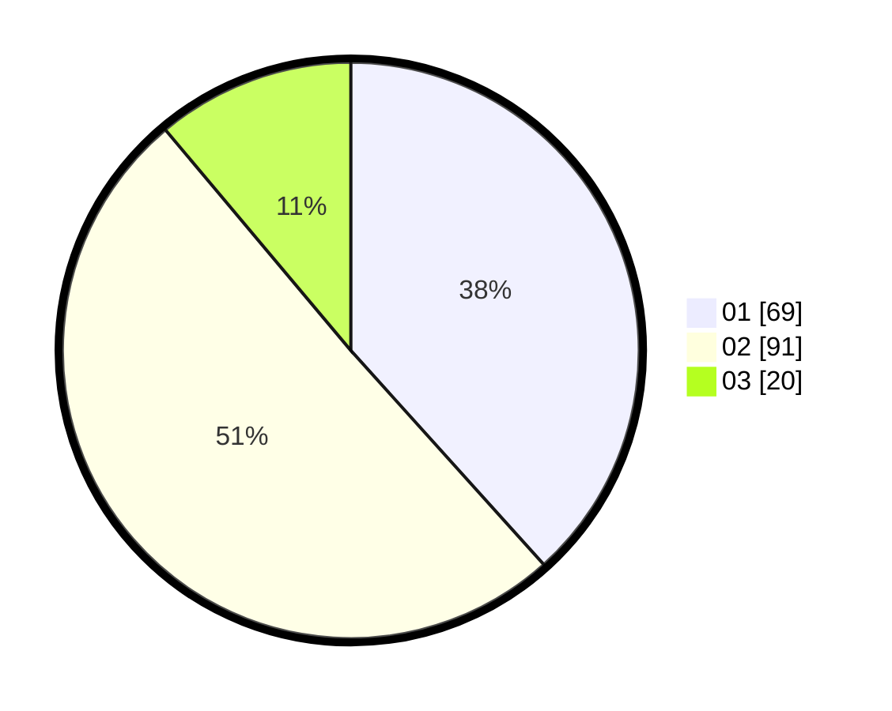

# Hasil

Hasil perolehan suara paslon dapat dilihat pada file paslon-01.txt, paslon-02.txt, dan paslon-03.txt.

Jika tidak ada, artinya data tersebut belum ada pada SIREKAP.

## Perolehan Suara

 * Paslon 01: **69**.
 * Paslon 02: **91**.
 * Paslon 03: **20**.

## Foto C Plano

https://sirekap-obj-formc.kpu.go.id/9904/pemilu/ppwp/31/71/01/10/06/3171011006050-20240214-210341--3081dbfd-8311-4399-95fc-2a2c1cf9388a.jpg

https://sirekap-obj-formc.kpu.go.id/9904/pemilu/ppwp/31/71/01/10/06/3171011006050-20240214-210518--7b0e7c8b-5e91-4c01-b515-3f65a9f14d18.jpg

https://sirekap-obj-formc.kpu.go.id/9904/pemilu/ppwp/31/71/01/10/06/3171011006050-20240214-210619--750cc218-b5ff-42dd-a128-3bf41abb890e.jpg

## DATA PEMILIH TETAP

Jumlah pemilih dalam DPT: **262**.
 * L: **138**.
 * P: **124**.

## DATA PENGGUNA HAK PILIH

Jumlah pengguna hak pilih dalam DPT: **186**.
 * L: **92**.
 * P: **94**.

Jumlah pengguna hak pilih dalam DPTb: **0**.
 * L: **0**.
 * P: **0**.

Jumlah pengguna hak pilih dalam DPK: **2**.
 * L: **2**.
 * P: **0**.

Jumlah pengguna hak pilih: **188**.
 * L: **94**.
 * P: **94**.

## JUMLAH SUARA SAH DAN TIDAK SAH

JUMLAH SELURUH SUARA SAH: **180**.

JUMLAH SUARA TIDAK SAH: **8**.

JUMLAH SELURUH SUARA SAH DAN SUARA TIDAK SAH: **188**.
