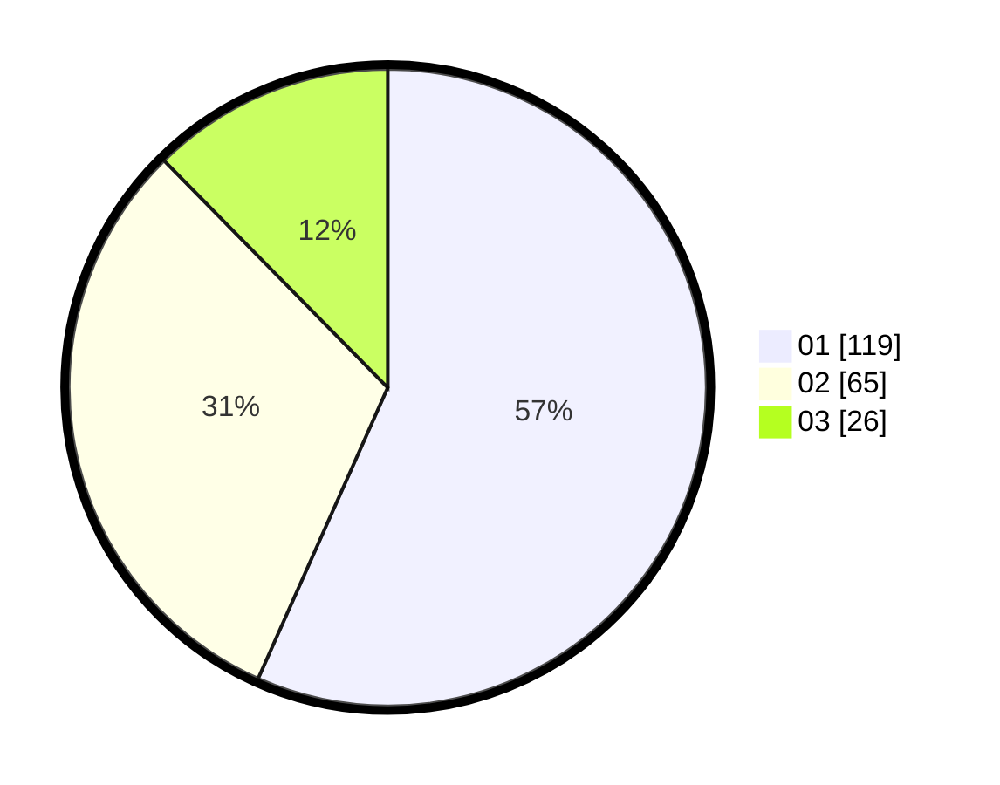

# Hasil

Hasil perolehan suara paslon dapat dilihat pada file paslon-01.txt, paslon-02.txt, dan paslon-03.txt.

Jika tidak ada, artinya data tersebut belum ada pada SIREKAP.

## Perolehan Suara

 * Paslon 01: **119**.
 * Paslon 02: **65**.
 * Paslon 03: **26**.

## Foto C Plano

https://sirekap-obj-formc.kpu.go.id/3254/pemilu/ppwp/31/71/01/10/06/3171011006051-20240214-155759--314f7266-9bb2-477e-b830-aa086587d0e4.jpg

https://sirekap-obj-formc.kpu.go.id/3254/pemilu/ppwp/31/71/01/10/06/3171011006051-20240214-160125--0d2b5540-12b1-44ff-895d-10905e523ef7.jpg

https://sirekap-obj-formc.kpu.go.id/3254/pemilu/ppwp/31/71/01/10/06/3171011006051-20240214-160122--aefa6016-8a52-4596-afc4-d60f544cd388.jpg
