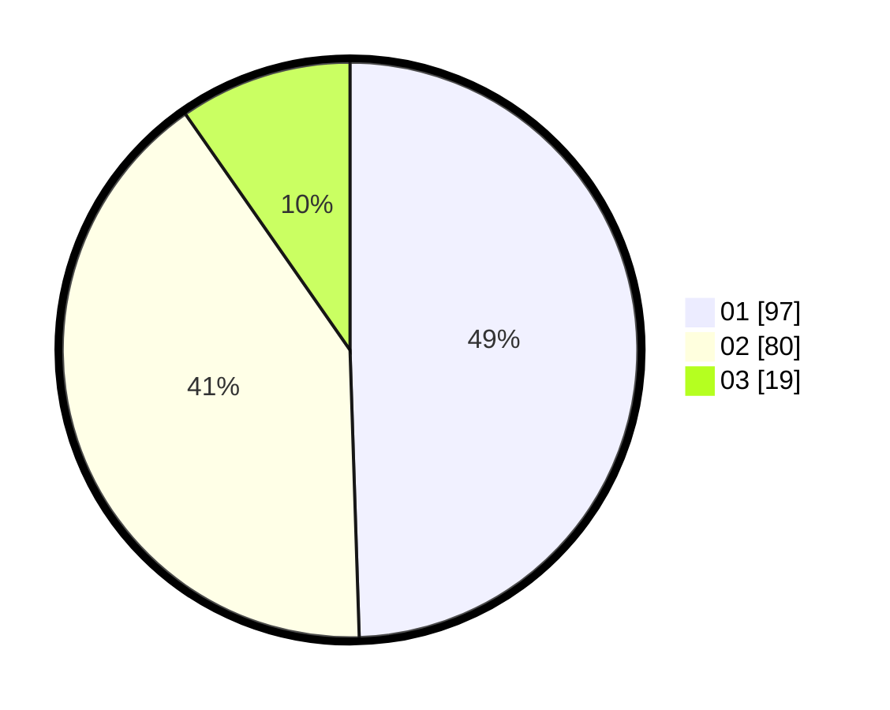

# Hasil

Hasil perolehan suara paslon dapat dilihat pada file paslon-01.txt, paslon-02.txt, dan paslon-03.txt.

Jika tidak ada, artinya data tersebut belum ada pada SIREKAP.

## Perolehan Suara

 * Paslon 01: **97**.
 * Paslon 02: **80**.
 * Paslon 03: **19**.

## Foto C Plano

https://sirekap-obj-formc.kpu.go.id/dcc7/pemilu/ppwp/31/71/01/10/06/3171011006053-20240214-205200--e85e318f-5f29-4321-b82d-129825c04a0d.jpg

https://sirekap-obj-formc.kpu.go.id/dcc7/pemilu/ppwp/31/71/01/10/06/3171011006053-20240214-160111--5c7a7bbe-fb47-4760-9bd5-82705d7116b8.jpg

https://sirekap-obj-formc.kpu.go.id/dcc7/pemilu/ppwp/31/71/01/10/06/3171011006053-20240214-160113--eb1230a9-2fb1-4f18-ac30-791d51dd7a5d.jpg

## DATA PEMILIH TETAP

Jumlah pemilih dalam DPT: **265**.
 * L: **133**.
 * P: **132**.

## DATA PENGGUNA HAK PILIH

Jumlah pengguna hak pilih dalam DPT: **196**.
 * L: **93**.
 * P: **103**.

Jumlah pengguna hak pilih dalam DPTb: **0**.
 * L: **0**.
 * P: **0**.

Jumlah pengguna hak pilih dalam DPK: **3**.
 * L: **1**.
 * P: **2**.

Jumlah pengguna hak pilih: **199**.
 * L: **94**.
 * P: **105**.

## JUMLAH SUARA SAH DAN TIDAK SAH

JUMLAH SELURUH SUARA SAH: **196**.

JUMLAH SUARA TIDAK SAH: **3**.

JUMLAH SELURUH SUARA SAH DAN SUARA TIDAK SAH: **199**.
