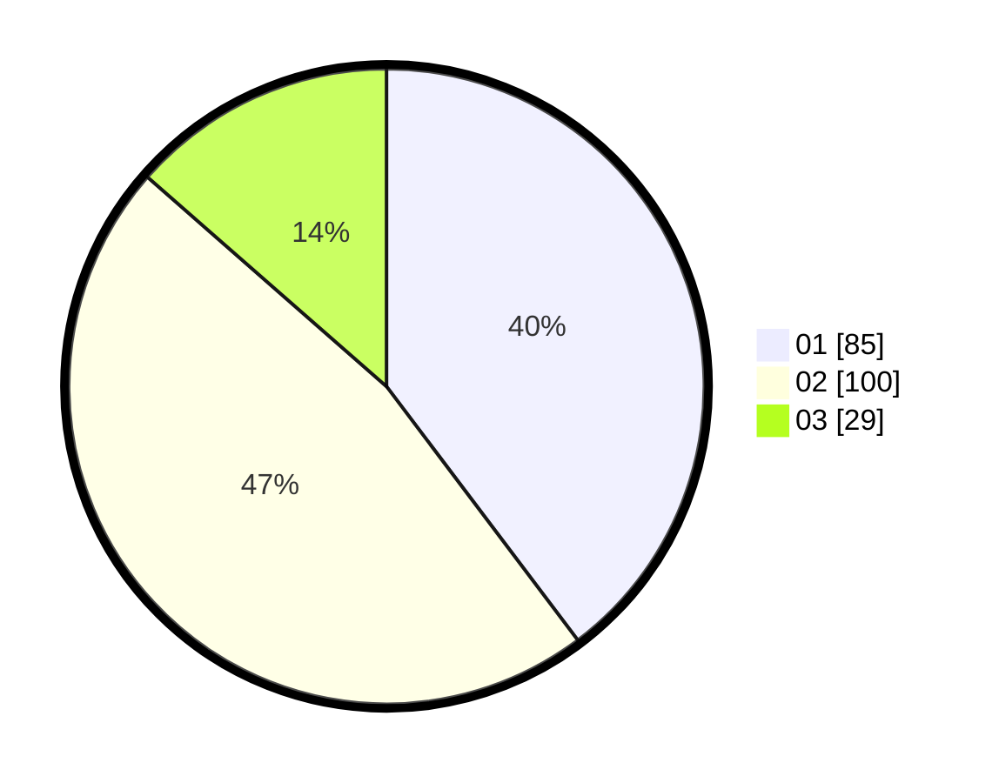

# Hasil

Hasil perolehan suara paslon dapat dilihat pada file paslon-01.txt, paslon-02.txt, dan paslon-03.txt.

Jika tidak ada, artinya data tersebut belum ada pada SIREKAP.

## Perolehan Suara

 * Paslon 01: **85**.
 * Paslon 02: **100**.
 * Paslon 03: **29**.

## Foto C Plano

https://sirekap-obj-formc.kpu.go.id/afae/pemilu/ppwp/31/71/01/10/06/3171011006059-20240214-160142--0f1a1e2f-6c0a-48d5-ad13-3d6cb4340482.jpg

https://sirekap-obj-formc.kpu.go.id/afae/pemilu/ppwp/31/71/01/10/06/3171011006059-20240214-190215--87bd75ee-b7ec-49c6-b8a6-427210ee309b.jpg

https://sirekap-obj-formc.kpu.go.id/afae/pemilu/ppwp/31/71/01/10/06/3171011006059-20240214-190255--67451ac5-67ad-4c12-9565-35cc73bda74f.jpg

## DATA PEMILIH TETAP

Jumlah pemilih dalam DPT: **271**.
 * L: **119**.
 * P: **152**.

## DATA PENGGUNA HAK PILIH

Jumlah pengguna hak pilih dalam DPT: **218**.
 * L: **97**.
 * P: **121**.

Jumlah pengguna hak pilih dalam DPTb: **0**.
 * L: **0**.
 * P: **0**.

Jumlah pengguna hak pilih dalam DPK: **0**.
 * L: **0**.
 * P: **0**.

Jumlah pengguna hak pilih: **218**.
 * L: **97**.
 * P: **121**.

## JUMLAH SUARA SAH DAN TIDAK SAH

JUMLAH SELURUH SUARA SAH: **214**.

JUMLAH SUARA TIDAK SAH: **4**.

JUMLAH SELURUH SUARA SAH DAN SUARA TIDAK SAH: **218**.
