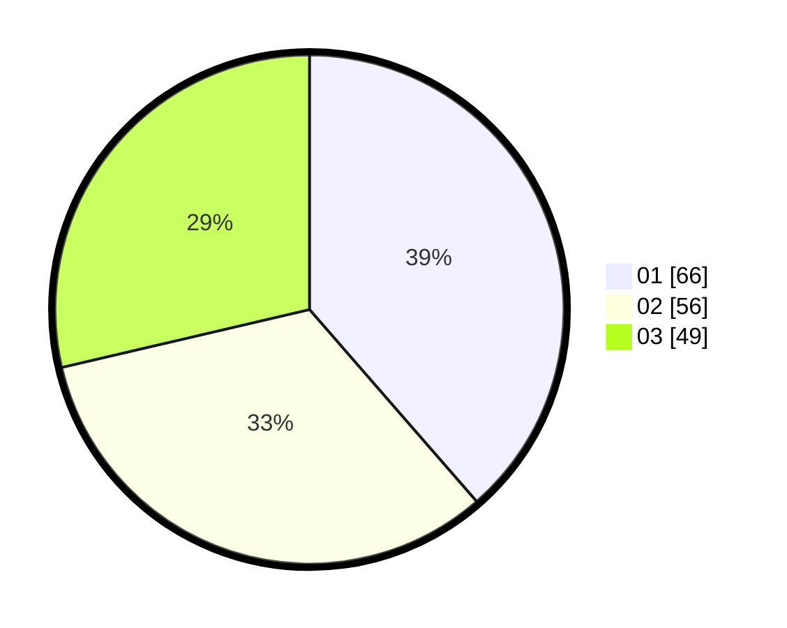

# Hasil

Hasil perolehan suara paslon dapat dilihat pada file paslon-01.txt, paslon-02.txt, dan paslon-03.txt.

Jika tidak ada, artinya data tersebut belum ada pada SIREKAP.

## Perolehan Suara

 * Paslon 01: **66**.
 * Paslon 02: **56**.
 * Paslon 03: **49**.

## Foto C Plano

https://sirekap-obj-formc.kpu.go.id/bb2c/pemilu/ppwp/31/71/01/10/06/3171011006060-20240214-155018--8bf5ea12-742e-4603-8c8a-cf2001088f08.jpg

https://sirekap-obj-formc.kpu.go.id/bb2c/pemilu/ppwp/31/71/01/10/06/3171011006060-20240214-155029--02a1a0ef-d311-494b-b334-b12ddb1761a5.jpg

https://sirekap-obj-formc.kpu.go.id/bb2c/pemilu/ppwp/31/71/01/10/06/3171011006060-20240214-155454--9b0746c5-36ac-4154-b7f9-86dfddef0780.jpg

## DATA PEMILIH TETAP

Jumlah pemilih dalam DPT: **258**.
 * L: **131**.
 * P: **127**.

## DATA PENGGUNA HAK PILIH

Jumlah pengguna hak pilih dalam DPT: **176**.
 * L: **87**.
 * P: **89**.

Jumlah pengguna hak pilih dalam DPTb: **0**.
 * L: **0**.
 * P: **0**.

Jumlah pengguna hak pilih dalam DPK: **0**.
 * L: **0**.
 * P: **0**.

Jumlah pengguna hak pilih: **176**.
 * L: **87**.
 * P: **89**.

## JUMLAH SUARA SAH DAN TIDAK SAH

JUMLAH SELURUH SUARA SAH: **171**.

JUMLAH SUARA TIDAK SAH: **5**.

JUMLAH SELURUH SUARA SAH DAN SUARA TIDAK SAH: **176**.
