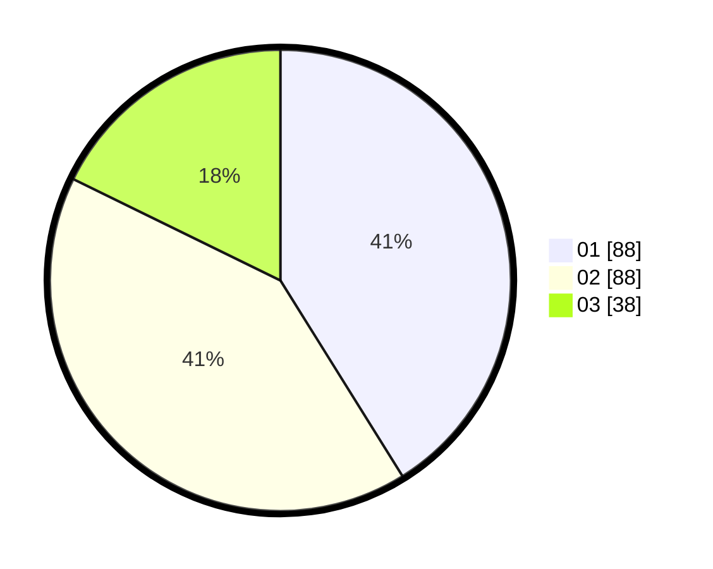

# Hasil

Hasil perolehan suara paslon dapat dilihat pada file paslon-01.txt, paslon-02.txt, dan paslon-03.txt.

Jika tidak ada, artinya data tersebut belum ada pada SIREKAP.

## Perolehan Suara

 * Paslon 01: **88**.
 * Paslon 02: **88**.
 * Paslon 03: **38**.

## Foto C Plano

https://sirekap-obj-formc.kpu.go.id/1724/pemilu/ppwp/31/71/01/10/06/3171011006064-20240216-062420--50c9751f-e977-45d3-8a98-d2608e7bcf2c.jpg

https://sirekap-obj-formc.kpu.go.id/1724/pemilu/ppwp/31/71/01/10/06/3171011006064-20240216-062422--1d308a64-5082-4ab8-8bbe-d16c192b8109.jpg

https://sirekap-obj-formc.kpu.go.id/1724/pemilu/ppwp/31/71/01/10/06/3171011006064-20240216-062421--482bd1d4-af42-4e42-be10-b8f4367850b1.jpg

## DATA PEMILIH TETAP

Jumlah pemilih dalam DPT: **270**.
 * L: **128**.
 * P: **142**.

## DATA PENGGUNA HAK PILIH

Jumlah pengguna hak pilih dalam DPT: **216**.
 * L: **105**.
 * P: **111**.

Jumlah pengguna hak pilih dalam DPTb: **0**.
 * L: **0**.
 * P: **0**.

Jumlah pengguna hak pilih dalam DPK: **0**.
 * L: **0**.
 * P: **0**.

Jumlah pengguna hak pilih: **216**.
 * L: **105**.
 * P: **111**.

## JUMLAH SUARA SAH DAN TIDAK SAH

JUMLAH SELURUH SUARA SAH: **214**.

JUMLAH SUARA TIDAK SAH: **2**.

JUMLAH SELURUH SUARA SAH DAN SUARA TIDAK SAH: **216**.
