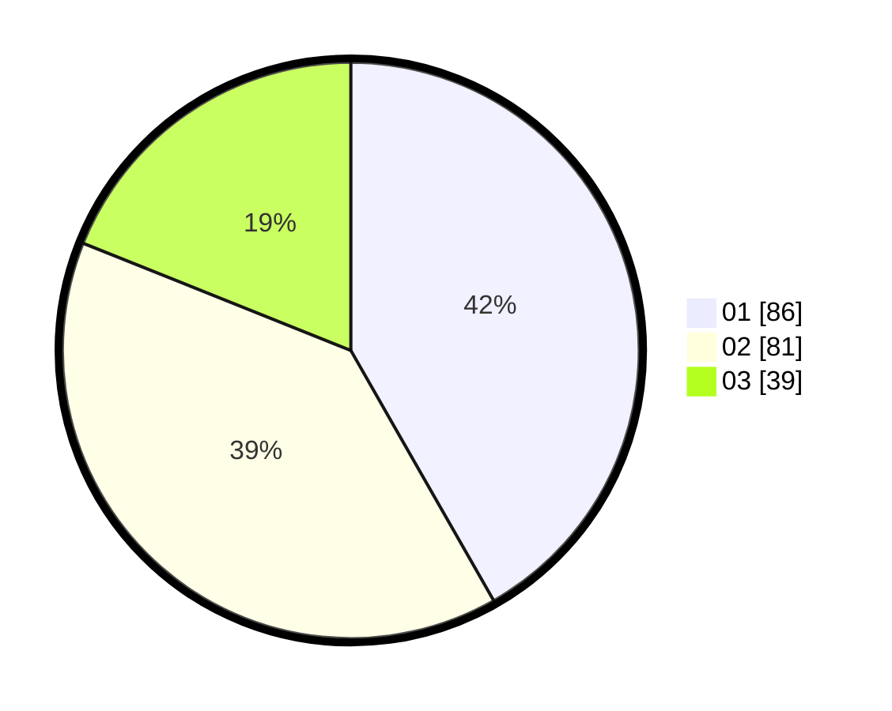

# Hasil

Hasil perolehan suara paslon dapat dilihat pada file paslon-01.txt, paslon-02.txt, dan paslon-03.txt.

Jika tidak ada, artinya data tersebut belum ada pada SIREKAP.

## Perolehan Suara

 * Paslon 01: **86**.
 * Paslon 02: **81**.
 * Paslon 03: **39**.

## Foto C Plano

https://sirekap-obj-formc.kpu.go.id/da88/pemilu/ppwp/31/71/01/10/06/3171011006065-20240214-155204--c5fe0441-806d-496e-9c7c-1e20493e650a.jpg

https://sirekap-obj-formc.kpu.go.id/da88/pemilu/ppwp/31/71/01/10/06/3171011006065-20240214-155208--8c7a9e8a-a8cd-46fb-9fc2-d32aeb6c3173.jpg

https://sirekap-obj-formc.kpu.go.id/da88/pemilu/ppwp/31/71/01/10/06/3171011006065-20240214-155213--0fe7c0c6-e2a3-474d-9fe2-9af59c07f026.jpg

## DATA PEMILIH TETAP

Jumlah pemilih dalam DPT: **270**.
 * L: **130**.
 * P: **140**.

## DATA PENGGUNA HAK PILIH

Jumlah pengguna hak pilih dalam DPT: **205**.
 * L: **100**.
 * P: **105**.

Jumlah pengguna hak pilih dalam DPTb: **0**.
 * L: **0**.
 * P: **0**.

Jumlah pengguna hak pilih dalam DPK: **4**.
 * L: **4**.
 * P: **0**.

Jumlah pengguna hak pilih: **209**.
 * L: **104**.
 * P: **105**.

## JUMLAH SUARA SAH DAN TIDAK SAH

JUMLAH SELURUH SUARA SAH: **206**.

JUMLAH SUARA TIDAK SAH: **3**.

JUMLAH SELURUH SUARA SAH DAN SUARA TIDAK SAH: **209**.
