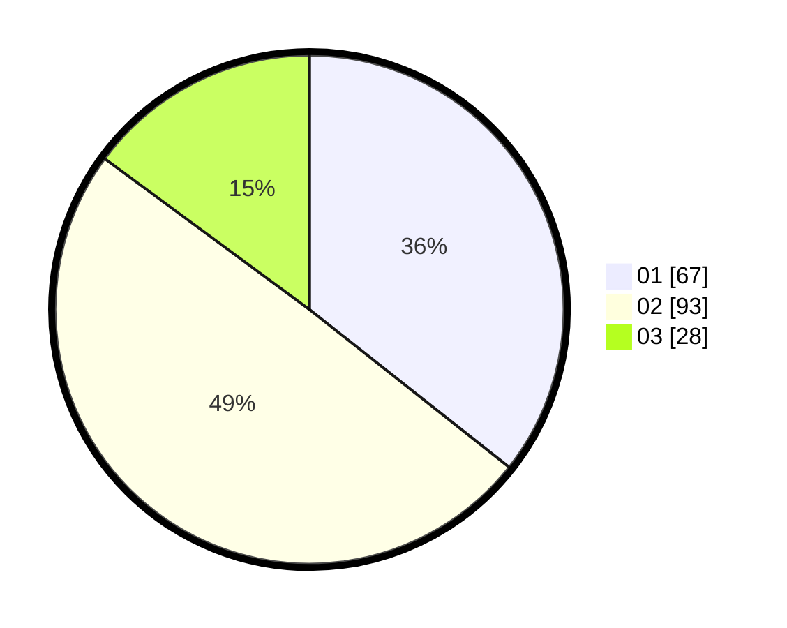

# Hasil

Hasil perolehan suara paslon dapat dilihat pada file paslon-01.txt, paslon-02.txt, dan paslon-03.txt.

Jika tidak ada, artinya data tersebut belum ada pada SIREKAP.

## Perolehan Suara

 * Paslon 01: **67**.
 * Paslon 02: **93**.
 * Paslon 03: **28**.

## Foto C Plano

https://sirekap-obj-formc.kpu.go.id/8934/pemilu/ppwp/31/71/01/10/06/3171011006066-20240215-145148--070038d0-273a-49fc-8bad-651c7dea3b28.jpg

https://sirekap-obj-formc.kpu.go.id/8934/pemilu/ppwp/31/71/01/10/06/3171011006066-20240215-145209--0ddff2a5-02af-4c12-8bdb-30a672be182b.jpg

https://sirekap-obj-formc.kpu.go.id/8934/pemilu/ppwp/31/71/01/10/06/3171011006066-20240215-145158--3863b2f9-7da9-4ab0-8b61-8b020a2cf1cb.jpg

## DATA PEMILIH TETAP

Jumlah pemilih dalam DPT: **256**.
 * L: **136**.
 * P: **120**.

## DATA PENGGUNA HAK PILIH

Jumlah pengguna hak pilih dalam DPT: **190**.
 * L: **95**.
 * P: **95**.

Jumlah pengguna hak pilih dalam DPTb: **0**.
 * L: **0**.
 * P: **0**.

Jumlah pengguna hak pilih dalam DPK: **1**.
 * L: **1**.
 * P: **0**.

Jumlah pengguna hak pilih: **191**.
 * L: **96**.
 * P: **95**.

## JUMLAH SUARA SAH DAN TIDAK SAH

JUMLAH SELURUH SUARA SAH: **188**.

JUMLAH SUARA TIDAK SAH: **3**.

JUMLAH SELURUH SUARA SAH DAN SUARA TIDAK SAH: **191**.
