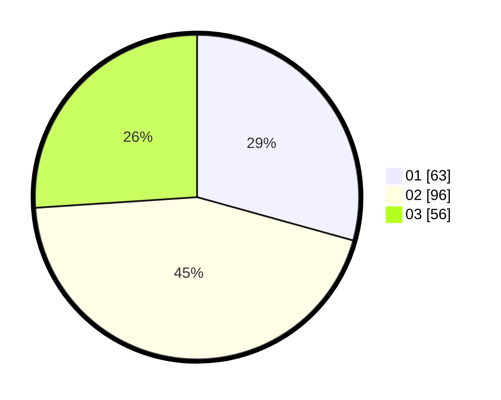

# Hasil

Hasil perolehan suara paslon dapat dilihat pada file paslon-01.txt, paslon-02.txt, dan paslon-03.txt.

Jika tidak ada, artinya data tersebut belum ada pada SIREKAP.

## Perolehan Suara

 * Paslon 01: **63**.
 * Paslon 02: **96**.
 * Paslon 03: **56**.

## Foto C Plano

https://sirekap-obj-formc.kpu.go.id/cf2d/pemilu/ppwp/31/71/02/10/01/3171021001002-20240214-211133--8aa07ee0-d016-4371-ab6a-616dfc8e141d.jpg

https://sirekap-obj-formc.kpu.go.id/cf2d/pemilu/ppwp/31/71/02/10/01/3171021001002-20240215-200412--47ca63ba-ae57-43fd-9f27-7bea52a01e0f.jpg

https://sirekap-obj-formc.kpu.go.id/cf2d/pemilu/ppwp/31/71/02/10/01/3171021001002-20240214-211151--894f9cf4-45b7-4632-9c73-a63d11ff4dd9.jpg

## DATA PEMILIH TETAP

Jumlah pemilih dalam DPT: **271**.
 * L: **128**.
 * P: **143**.

## DATA PENGGUNA HAK PILIH

Jumlah pengguna hak pilih dalam DPT: **198**.
 * L: **95**.
 * P: **103**.

Jumlah pengguna hak pilih dalam DPTb: **19**.
 * L: **7**.
 * P: **12**.

Jumlah pengguna hak pilih dalam DPK: **0**.
 * L: **0**.
 * P: **0**.

Jumlah pengguna hak pilih: **217**.
 * L: **102**.
 * P: **115**.

## JUMLAH SUARA SAH DAN TIDAK SAH

JUMLAH SELURUH SUARA SAH: **215**.

JUMLAH SUARA TIDAK SAH: **2**.

JUMLAH SELURUH SUARA SAH DAN SUARA TIDAK SAH: **217**.
