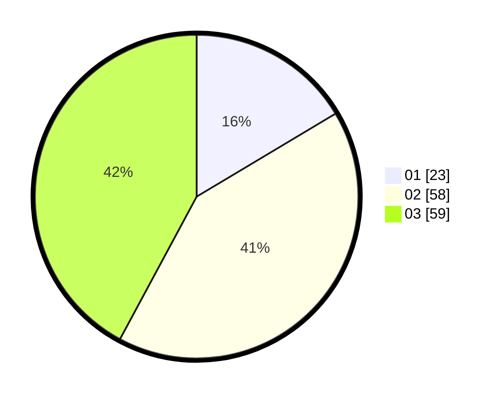

# Hasil

Hasil perolehan suara paslon dapat dilihat pada file paslon-01.txt, paslon-02.txt, dan paslon-03.txt.

Jika tidak ada, artinya data tersebut belum ada pada SIREKAP.

## Perolehan Suara

 * Paslon 01: **23**.
 * Paslon 02: **58**.
 * Paslon 03: **59**.

## Foto C Plano

https://sirekap-obj-formc.kpu.go.id/f10b/pemilu/ppwp/31/71/02/10/01/3171021001004-20240216-154447--7ae73dbb-b346-41b7-ac56-2782ae6f12c2.jpg

https://sirekap-obj-formc.kpu.go.id/f10b/pemilu/ppwp/31/71/02/10/01/3171021001004-20240216-154448--07d24bfe-afe9-4f33-8421-685f261341a9.jpg

https://sirekap-obj-formc.kpu.go.id/f10b/pemilu/ppwp/31/71/02/10/01/3171021001004-20240216-154448--e5ec238c-5991-4f69-9b74-489828a2e1cc.jpg

## DATA PEMILIH TETAP

Jumlah pemilih dalam DPT: **238**.
 * L: **113**.
 * P: **125**.

## DATA PENGGUNA HAK PILIH

Jumlah pengguna hak pilih dalam DPT: **128**.
 * L: **63**.
 * P: **65**.

Jumlah pengguna hak pilih dalam DPTb: **12**.
 * L: **5**.
 * P: **7**.

Jumlah pengguna hak pilih dalam DPK: **0**.
 * L: **0**.
 * P: **0**.

Jumlah pengguna hak pilih: **140**.
 * L: **68**.
 * P: **72**.

## JUMLAH SUARA SAH DAN TIDAK SAH

JUMLAH SELURUH SUARA SAH: **140**.

JUMLAH SUARA TIDAK SAH: **0**.

JUMLAH SELURUH SUARA SAH DAN SUARA TIDAK SAH: **140**.
