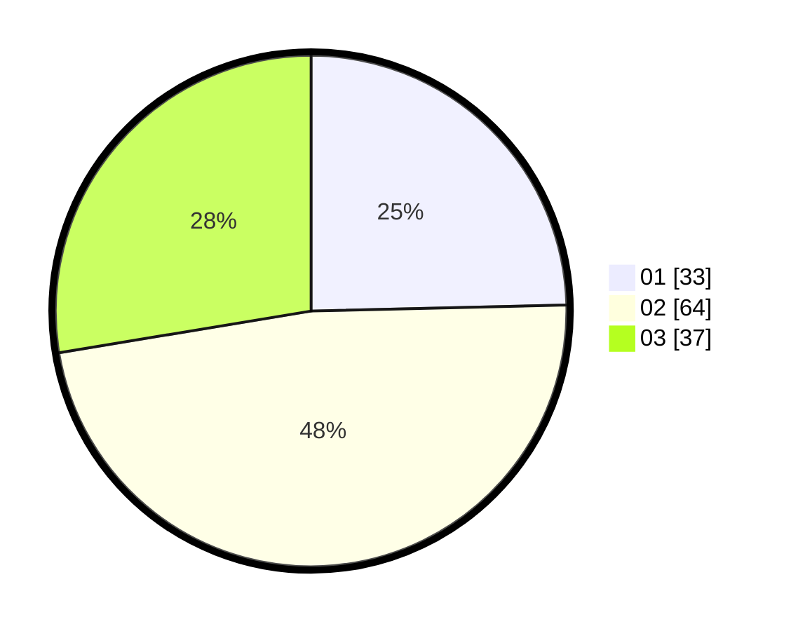

# Hasil

Hasil perolehan suara paslon dapat dilihat pada file paslon-01.txt, paslon-02.txt, dan paslon-03.txt.

Jika tidak ada, artinya data tersebut belum ada pada SIREKAP.

## Perolehan Suara

 * Paslon 01: **33**.
 * Paslon 02: **64**.
 * Paslon 03: **37**.

## Foto C Plano

https://sirekap-obj-formc.kpu.go.id/0b30/pemilu/ppwp/31/71/02/10/01/3171021001005-20240216-044947--e23eacb0-a9b0-4726-8b5a-a7996ce521b5.jpg

https://sirekap-obj-formc.kpu.go.id/0b30/pemilu/ppwp/31/71/02/10/01/3171021001005-20240216-044954--d893916e-ce8f-4012-bca7-6405ec8d15a5.jpg

https://sirekap-obj-formc.kpu.go.id/0b30/pemilu/ppwp/31/71/02/10/01/3171021001005-20240216-044949--13ebbd52-ceb9-4161-80ef-e7ea4e38a1f0.jpg

## DATA PEMILIH TETAP

Jumlah pemilih dalam DPT: **201**.
 * L: **94**.
 * P: **107**.

## DATA PENGGUNA HAK PILIH

Jumlah pengguna hak pilih dalam DPT: **127**.
 * L: **61**.
 * P: **66**.

Jumlah pengguna hak pilih dalam DPTb: **11**.
 * L: **2**.
 * P: **9**.

Jumlah pengguna hak pilih dalam DPK: **0**.
 * L: **0**.
 * P: **0**.

Jumlah pengguna hak pilih: **138**.
 * L: **63**.
 * P: **75**.

## JUMLAH SUARA SAH DAN TIDAK SAH

JUMLAH SELURUH SUARA SAH: **134**.

JUMLAH SUARA TIDAK SAH: **4**.

JUMLAH SELURUH SUARA SAH DAN SUARA TIDAK SAH: **138**.
