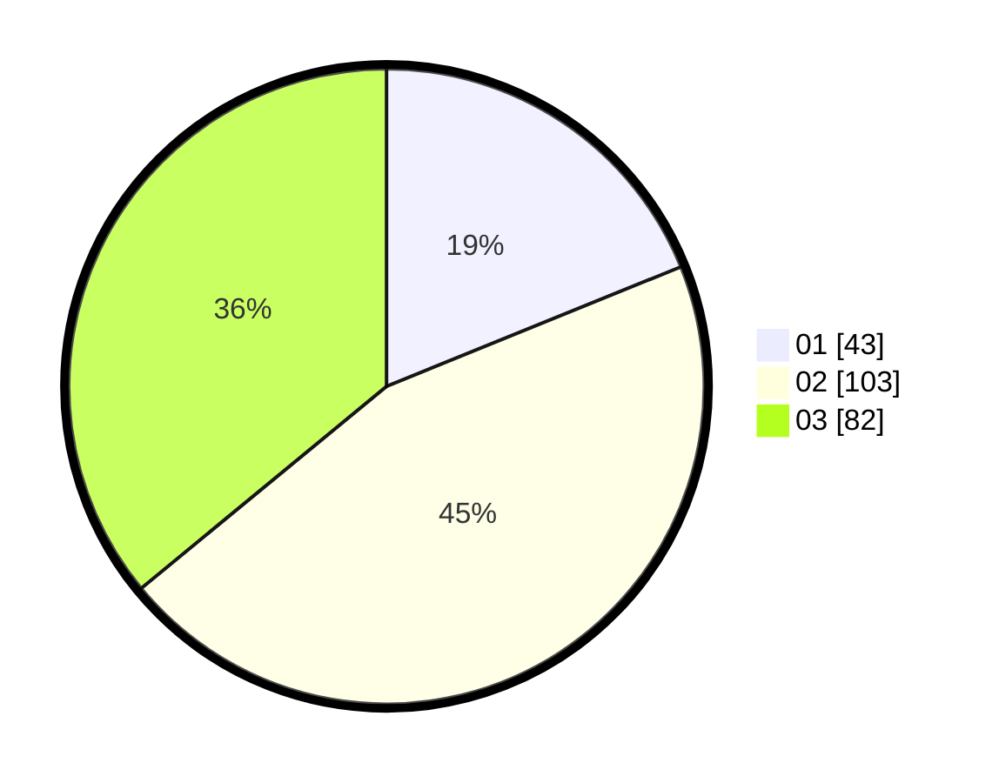

# Hasil

Hasil perolehan suara paslon dapat dilihat pada file paslon-01.txt, paslon-02.txt, dan paslon-03.txt.

Jika tidak ada, artinya data tersebut belum ada pada SIREKAP.

## Perolehan Suara

 * Paslon 01: **43**.
 * Paslon 02: **103**.
 * Paslon 03: **82**.

## Foto C Plano

https://sirekap-obj-formc.kpu.go.id/6955/pemilu/ppwp/31/71/02/10/01/3171021001006-20240214-200124--1cb4d4a2-01cb-4ef5-b6ed-53ca096de915.jpg

https://sirekap-obj-formc.kpu.go.id/6955/pemilu/ppwp/31/71/02/10/01/3171021001006-20240214-190930--02210fd6-a640-4f07-b1b3-7cadb62683b0.jpg
