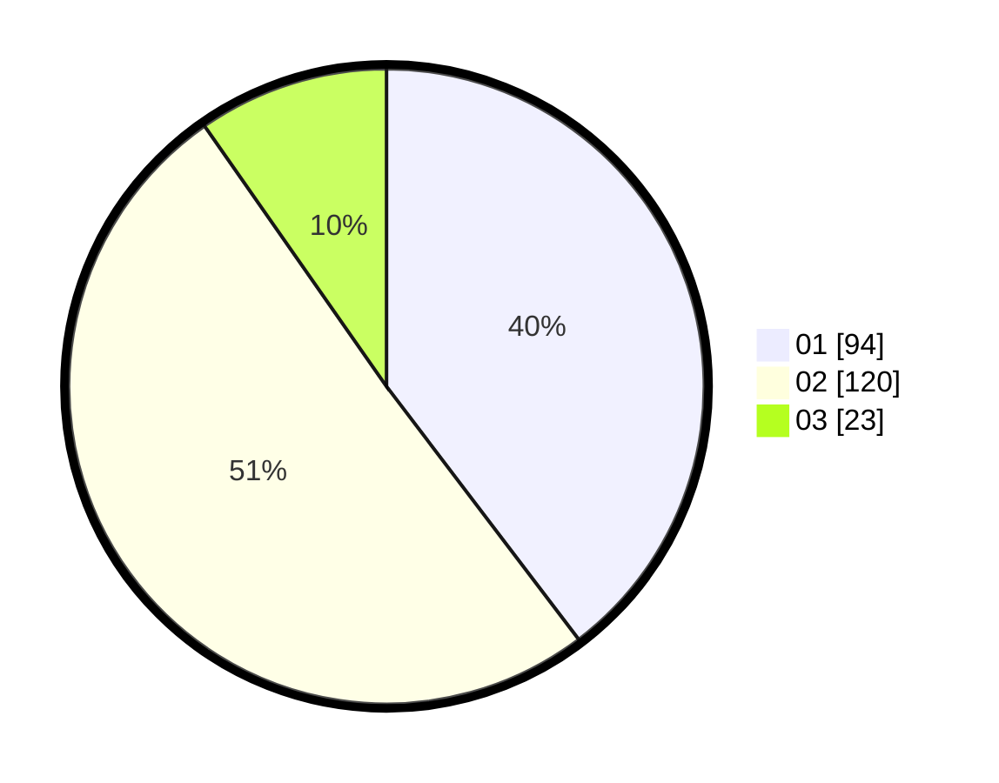

# Hasil

Hasil perolehan suara paslon dapat dilihat pada file paslon-01.txt, paslon-02.txt, dan paslon-03.txt.

Jika tidak ada, artinya data tersebut belum ada pada SIREKAP.

## Perolehan Suara

 * Paslon 01: **94**.
 * Paslon 02: **120**.
 * Paslon 03: **23**.

## Foto C Plano

https://sirekap-obj-formc.kpu.go.id/9737/pemilu/ppwp/31/71/02/10/01/3171021001012-20240214-195118--1b67f5b2-28c1-4bdf-9aba-406a3985591c.jpg

https://sirekap-obj-formc.kpu.go.id/9737/pemilu/ppwp/31/71/02/10/01/3171021001012-20240214-155813--d0f9cde6-309e-42c6-b615-07ac6c81faeb.jpg

https://sirekap-obj-formc.kpu.go.id/9737/pemilu/ppwp/31/71/02/10/01/3171021001012-20240214-155854--96c6a2b7-c756-48e9-aedb-c1dcf8fb72a2.jpg

## DATA PEMILIH TETAP

Jumlah pemilih dalam DPT: **278**.
 * L: **140**.
 * P: **138**.

## DATA PENGGUNA HAK PILIH

Jumlah pengguna hak pilih dalam DPT: **210**.
 * L: **104**.
 * P: **106**.

Jumlah pengguna hak pilih dalam DPTb: **25**.
 * L: **9**.
 * P: **16**.

Jumlah pengguna hak pilih dalam DPK: **4**.
 * L: **1**.
 * P: **3**.

Jumlah pengguna hak pilih: **239**.
 * L: **210**.
 * P: **29**.

## JUMLAH SUARA SAH DAN TIDAK SAH

JUMLAH SELURUH SUARA SAH: **237**.

JUMLAH SUARA TIDAK SAH: **2**.

JUMLAH SELURUH SUARA SAH DAN SUARA TIDAK SAH: **239**.
