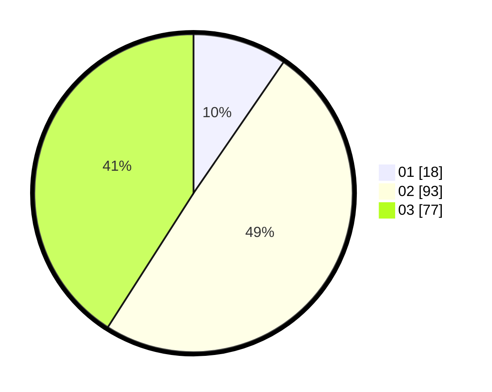

# Hasil

Hasil perolehan suara paslon dapat dilihat pada file paslon-01.txt, paslon-02.txt, dan paslon-03.txt.

Jika tidak ada, artinya data tersebut belum ada pada SIREKAP.

## Perolehan Suara

 * Paslon 01: **18**.
 * Paslon 02: **93**.
 * Paslon 03: **77**.

## Foto C Plano

https://sirekap-obj-formc.kpu.go.id/cc97/pemilu/ppwp/31/71/02/10/01/3171021001014-20240216-155801--4e793167-323c-41f6-8989-919e0a362e6b.jpg

https://sirekap-obj-formc.kpu.go.id/cc97/pemilu/ppwp/31/71/02/10/01/3171021001014-20240216-155803--9ac35850-4e4a-4911-84f8-35a6ccf6a9d1.jpg

https://sirekap-obj-formc.kpu.go.id/cc97/pemilu/ppwp/31/71/02/10/01/3171021001014-20240216-155802--53cb3b6c-8379-4412-8bd0-c13480538a0d.jpg

## DATA PEMILIH TETAP

Jumlah pemilih dalam DPT: **251**.
 * L: **131**.
 * P: **120**.

## DATA PENGGUNA HAK PILIH

Jumlah pengguna hak pilih dalam DPT: **175**.
 * L: **93**.
 * P: **82**.

Jumlah pengguna hak pilih dalam DPTb: **14**.
 * L: **7**.
 * P: **7**.

Jumlah pengguna hak pilih dalam DPK: **1**.
 * L: **1**.
 * P: **0**.

Jumlah pengguna hak pilih: **190**.
 * L: **101**.
 * P: **89**.

## JUMLAH SUARA SAH DAN TIDAK SAH

JUMLAH SELURUH SUARA SAH: **188**.

JUMLAH SUARA TIDAK SAH: **2**.

JUMLAH SELURUH SUARA SAH DAN SUARA TIDAK SAH: **190**.
