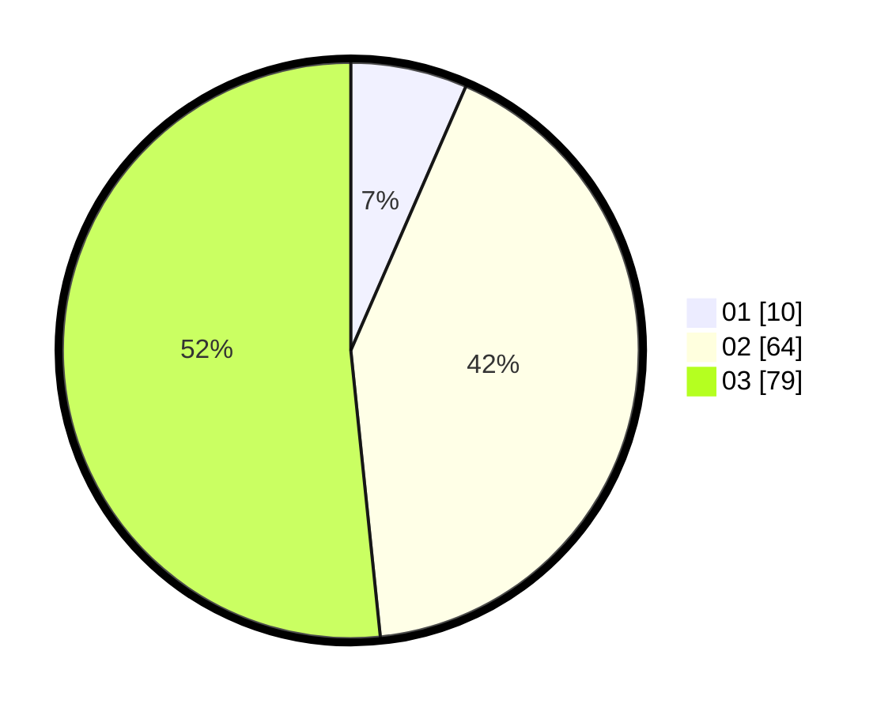

# Hasil

Hasil perolehan suara paslon dapat dilihat pada file paslon-01.txt, paslon-02.txt, dan paslon-03.txt.

Jika tidak ada, artinya data tersebut belum ada pada SIREKAP.

## Perolehan Suara

 * Paslon 01: **10**.
 * Paslon 02: **64**.
 * Paslon 03: **79**.

## Foto C Plano

https://sirekap-obj-formc.kpu.go.id/5957/pemilu/ppwp/31/71/02/10/01/3171021001015-20240216-004516--d75a04b7-b0c0-4c94-b278-50eb36eeec98.jpg

https://sirekap-obj-formc.kpu.go.id/5957/pemilu/ppwp/31/71/02/10/01/3171021001015-20240216-004526--eb43a977-ab92-4a64-aed4-ecc3d1ddf71c.jpg

https://sirekap-obj-formc.kpu.go.id/5957/pemilu/ppwp/31/71/02/10/01/3171021001015-20240216-004524--f6287efe-a318-4241-975c-b3ad4a29d9ef.jpg

## DATA PEMILIH TETAP

Jumlah pemilih dalam DPT: **199**.
 * L: **99**.
 * P: **100**.

## DATA PENGGUNA HAK PILIH

Jumlah pengguna hak pilih dalam DPT: **148**.
 * L: **71**.
 * P: **77**.

Jumlah pengguna hak pilih dalam DPTb: **8**.
 * L: **1**.
 * P: **7**.

Jumlah pengguna hak pilih dalam DPK: **1**.
 * L: **1**.
 * P: **0**.

Jumlah pengguna hak pilih: **157**.
 * L: **73**.
 * P: **84**.

## JUMLAH SUARA SAH DAN TIDAK SAH

JUMLAH SELURUH SUARA SAH: **0**.

JUMLAH SUARA TIDAK SAH: **4**.

JUMLAH SELURUH SUARA SAH DAN SUARA TIDAK SAH: **0**.
