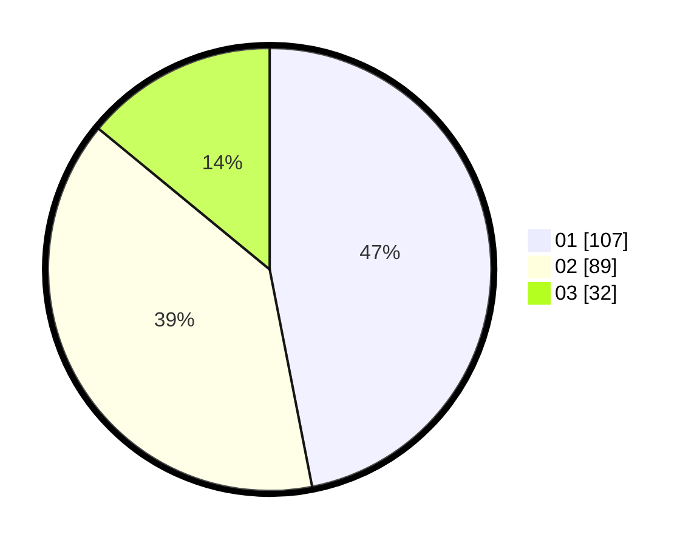

# Hasil

Hasil perolehan suara paslon dapat dilihat pada file paslon-01.txt, paslon-02.txt, dan paslon-03.txt.

Jika tidak ada, artinya data tersebut belum ada pada SIREKAP.

## Perolehan Suara

 * Paslon 01: **107**.
 * Paslon 02: **89**.
 * Paslon 03: **32**.

## Foto C Plano

https://sirekap-obj-formc.kpu.go.id/046a/pemilu/ppwp/31/71/02/10/01/3171021001020-20240217-161006--76e2cf17-0db9-4f2d-8d81-ef4e19ba2db0.jpg

https://sirekap-obj-formc.kpu.go.id/046a/pemilu/ppwp/31/71/02/10/01/3171021001020-20240217-172600--08d2d783-ae7c-4f8b-9354-ec8e09d3e602.jpg

https://sirekap-obj-formc.kpu.go.id/046a/pemilu/ppwp/31/71/02/10/01/3171021001020-20240217-172559--8f34d9fb-4529-459d-9fd9-469180acdce7.jpg

## DATA PEMILIH TETAP

Jumlah pemilih dalam DPT: **285**.
 * L: **152**.
 * P: **133**.

## DATA PENGGUNA HAK PILIH

Jumlah pengguna hak pilih dalam DPT: **208**.
 * L: **107**.
 * P: **101**.

Jumlah pengguna hak pilih dalam DPTb: **18**.
 * L: **7**.
 * P: **11**.

Jumlah pengguna hak pilih dalam DPK: **4**.
 * L: **1**.
 * P: **3**.

Jumlah pengguna hak pilih: **230**.
 * L: **115**.
 * P: **115**.

## JUMLAH SUARA SAH DAN TIDAK SAH

JUMLAH SELURUH SUARA SAH: **228**.

JUMLAH SUARA TIDAK SAH: **2**.

JUMLAH SELURUH SUARA SAH DAN SUARA TIDAK SAH: **230**.
