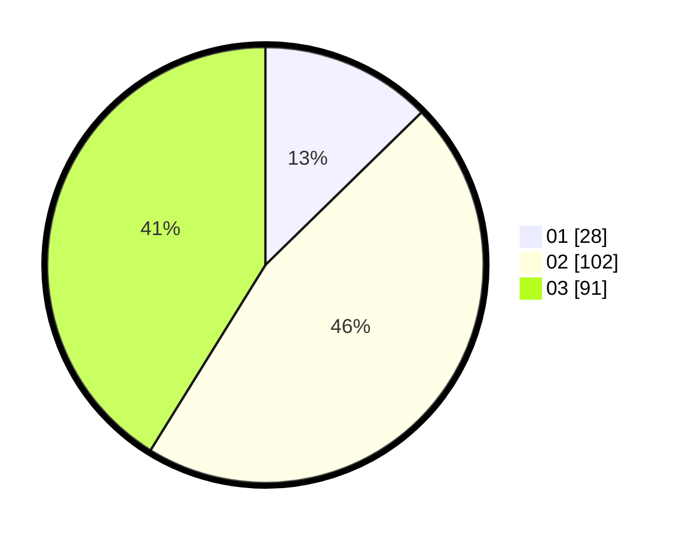

# Hasil

Hasil perolehan suara paslon dapat dilihat pada file paslon-01.txt, paslon-02.txt, dan paslon-03.txt.

Jika tidak ada, artinya data tersebut belum ada pada SIREKAP.

## Perolehan Suara

 * Paslon 01: **28**.
 * Paslon 02: **102**.
 * Paslon 03: **91**.

## Foto C Plano

https://sirekap-obj-formc.kpu.go.id/27a1/pemilu/ppwp/31/71/02/10/01/3171021001022-20240215-225749--257f7523-c6e1-4960-9a01-c6b3611f4e70.jpg

https://sirekap-obj-formc.kpu.go.id/27a1/pemilu/ppwp/31/71/02/10/01/3171021001022-20240215-225753--2591c0c8-42b9-466a-a961-7fa78a8348b2.jpg

https://sirekap-obj-formc.kpu.go.id/27a1/pemilu/ppwp/31/71/02/10/01/3171021001022-20240215-225751--e18a9095-149a-4dab-9515-eb5257ec7b1c.jpg

## DATA PEMILIH TETAP

Jumlah pemilih dalam DPT: **273**.
 * L: **127**.
 * P: **146**.

## DATA PENGGUNA HAK PILIH

Jumlah pengguna hak pilih dalam DPT: **198**.
 * L: **87**.
 * P: **111**.

Jumlah pengguna hak pilih dalam DPTb: **19**.
 * L: **7**.
 * P: **12**.

Jumlah pengguna hak pilih dalam DPK: **4**.
 * L: **0**.
 * P: **4**.

Jumlah pengguna hak pilih: **221**.
 * L: **94**.
 * P: **127**.

## JUMLAH SUARA SAH DAN TIDAK SAH

JUMLAH SELURUH SUARA SAH: **221**.

JUMLAH SUARA TIDAK SAH: **0**.

JUMLAH SELURUH SUARA SAH DAN SUARA TIDAK SAH: **221**.
