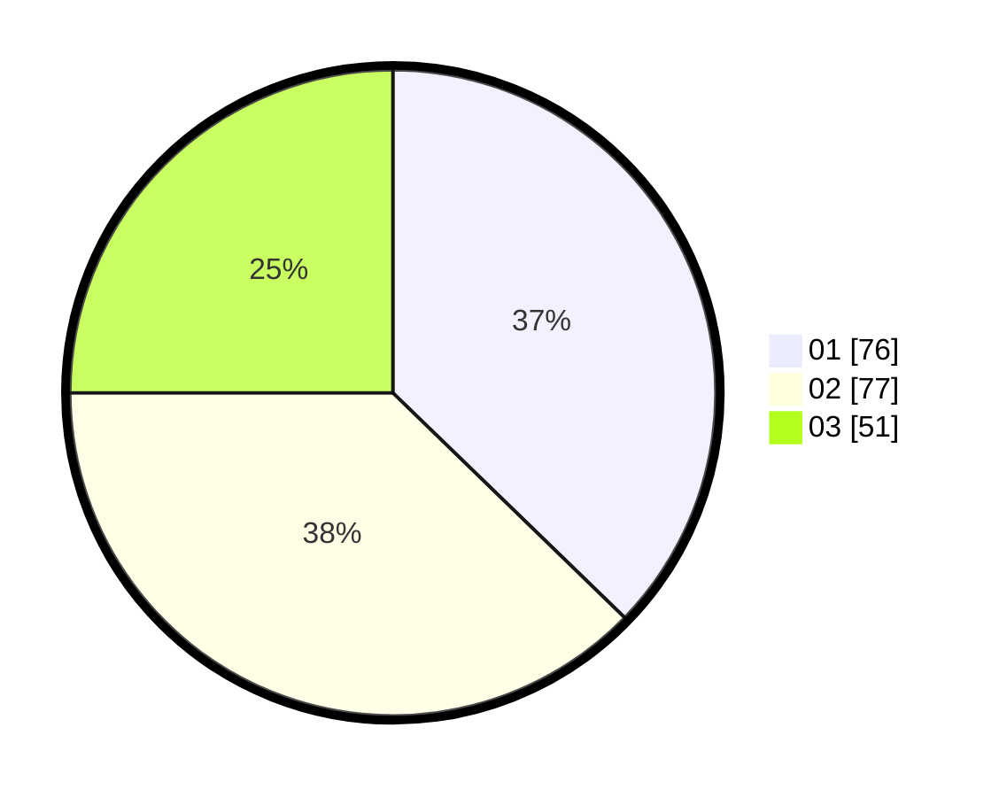

# Hasil

Hasil perolehan suara paslon dapat dilihat pada file paslon-01.txt, paslon-02.txt, dan paslon-03.txt.

Jika tidak ada, artinya data tersebut belum ada pada SIREKAP.

## Perolehan Suara

 * Paslon 01: **76**.
 * Paslon 02: **77**.
 * Paslon 03: **51**.

## Foto C Plano

https://sirekap-obj-formc.kpu.go.id/e466/pemilu/ppwp/31/71/02/10/01/3171021001024-20240214-220630--3815ee8c-8e61-4323-8d77-dbb9b527ca7d.jpg

https://sirekap-obj-formc.kpu.go.id/e466/pemilu/ppwp/31/71/02/10/01/3171021001024-20240217-192807--9d75e31b-75cc-41e1-a73f-284c2e69fbf9.jpg

https://sirekap-obj-formc.kpu.go.id/e466/pemilu/ppwp/31/71/02/10/01/3171021001024-20240217-103804--4d990a98-7d2e-4322-877b-6ba4e01d918a.jpg

## DATA PEMILIH TETAP

Jumlah pemilih dalam DPT: **258**.
 * L: **129**.
 * P: **129**.

## DATA PENGGUNA HAK PILIH

Jumlah pengguna hak pilih dalam DPT: **187**.
 * L: **90**.
 * P: **97**.

Jumlah pengguna hak pilih dalam DPTb: **17**.
 * L: **7**.
 * P: **10**.

Jumlah pengguna hak pilih dalam DPK: **1**.
 * L: **1**.
 * P: **0**.

Jumlah pengguna hak pilih: **205**.
 * L: **98**.
 * P: **107**.

## JUMLAH SUARA SAH DAN TIDAK SAH

JUMLAH SELURUH SUARA SAH: **204**.

JUMLAH SUARA TIDAK SAH: **1**.

JUMLAH SELURUH SUARA SAH DAN SUARA TIDAK SAH: **205**.
