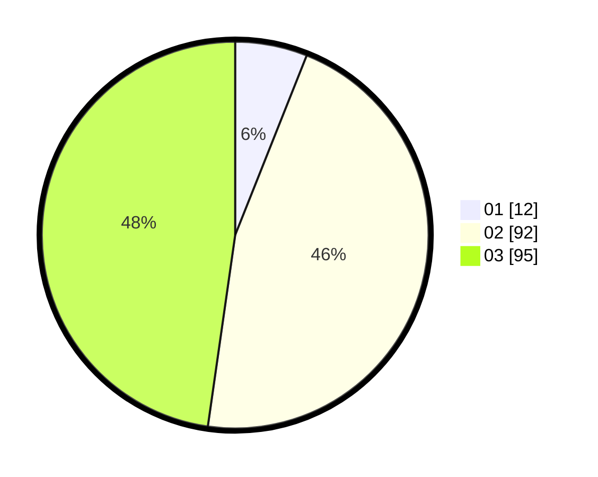

# Hasil

Hasil perolehan suara paslon dapat dilihat pada file paslon-01.txt, paslon-02.txt, dan paslon-03.txt.

Jika tidak ada, artinya data tersebut belum ada pada SIREKAP.

## Perolehan Suara

 * Paslon 01: **12**.
 * Paslon 02: **92**.
 * Paslon 03: **95**.

## Foto C Plano

https://sirekap-obj-formc.kpu.go.id/8a89/pemilu/ppwp/31/71/02/10/01/3171021001026-20240217-205830--98a59467-fc26-40d8-8845-6263df8e9739.jpg

https://sirekap-obj-formc.kpu.go.id/8a89/pemilu/ppwp/31/71/02/10/01/3171021001026-20240217-205831--8c5de72b-c4de-4a4e-b057-ec4076cff858.jpg

https://sirekap-obj-formc.kpu.go.id/8a89/pemilu/ppwp/31/71/02/10/01/3171021001026-20240217-205830--93259f94-52ba-4a06-a883-502f88a6e0f9.jpg

## DATA PEMILIH TETAP

Jumlah pemilih dalam DPT: **260**.
 * L: **129**.
 * P: **131**.

## DATA PENGGUNA HAK PILIH

Jumlah pengguna hak pilih dalam DPT: **170**.
 * L: **92**.
 * P: **78**.

Jumlah pengguna hak pilih dalam DPTb: **21**.
 * L: **11**.
 * P: **10**.

Jumlah pengguna hak pilih dalam DPK: **10**.
 * L: **2**.
 * P: **8**.

Jumlah pengguna hak pilih: **201**.
 * L: **105**.
 * P: **96**.

## JUMLAH SUARA SAH DAN TIDAK SAH

JUMLAH SELURUH SUARA SAH: **199**.

JUMLAH SUARA TIDAK SAH: **2**.

JUMLAH SELURUH SUARA SAH DAN SUARA TIDAK SAH: **201**.
