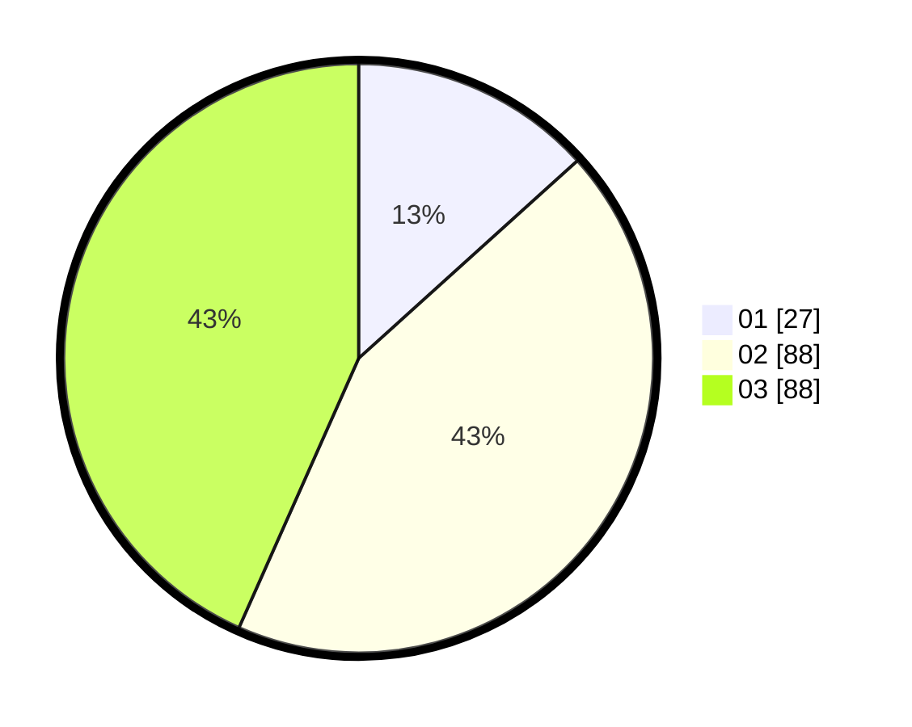

# Hasil

Hasil perolehan suara paslon dapat dilihat pada file paslon-01.txt, paslon-02.txt, dan paslon-03.txt.

Jika tidak ada, artinya data tersebut belum ada pada SIREKAP.

## Perolehan Suara

 * Paslon 01: **27**.
 * Paslon 02: **88**.
 * Paslon 03: **88**.

## Foto C Plano

https://sirekap-obj-formc.kpu.go.id/2165/pemilu/ppwp/31/71/02/10/01/3171021001027-20240214-191615--f9d70efe-c2df-4ccc-83a2-e1e8ece0db7a.jpg

https://sirekap-obj-formc.kpu.go.id/2165/pemilu/ppwp/31/71/02/10/01/3171021001027-20240214-192931--c351949f-8152-4a44-8ed9-77ec90043970.jpg

https://sirekap-obj-formc.kpu.go.id/2165/pemilu/ppwp/31/71/02/10/01/3171021001027-20240214-193931--27eeec93-766e-42af-805c-75109a1a3e5b.jpg

## DATA PEMILIH TETAP

Jumlah pemilih dalam DPT: **277**.
 * L: **128**.
 * P: **149**.

## DATA PENGGUNA HAK PILIH

Jumlah pengguna hak pilih dalam DPT: **197**.
 * L: **90**.
 * P: **107**.

Jumlah pengguna hak pilih dalam DPTb: **13**.
 * L: **6**.
 * P: **7**.

Jumlah pengguna hak pilih dalam DPK: **2**.
 * L: **0**.
 * P: **2**.

Jumlah pengguna hak pilih: **212**.
 * L: **96**.
 * P: **116**.

## JUMLAH SUARA SAH DAN TIDAK SAH

JUMLAH SELURUH SUARA SAH: **203**.

JUMLAH SUARA TIDAK SAH: **9**.

JUMLAH SELURUH SUARA SAH DAN SUARA TIDAK SAH: **212**.
