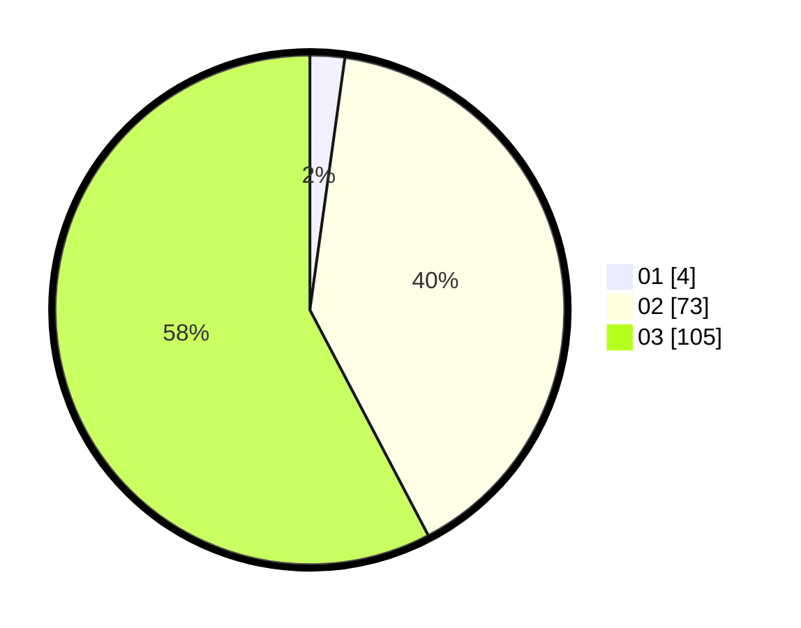

# Hasil

Hasil perolehan suara paslon dapat dilihat pada file paslon-01.txt, paslon-02.txt, dan paslon-03.txt.

Jika tidak ada, artinya data tersebut belum ada pada SIREKAP.

## Perolehan Suara

 * Paslon 01: **4**.
 * Paslon 02: **73**.
 * Paslon 03: **105**.

## Foto C Plano

https://sirekap-obj-formc.kpu.go.id/4505/pemilu/ppwp/31/71/02/10/01/3171021001030-20240214-223204--6317a104-d0e3-42e8-8cd0-2aa609a93b7d.jpg

https://sirekap-obj-formc.kpu.go.id/4505/pemilu/ppwp/31/71/02/10/01/3171021001030-20240214-223415--233bdd42-4d6d-4fc8-a466-0a63c7f791b0.jpg

https://sirekap-obj-formc.kpu.go.id/4505/pemilu/ppwp/31/71/02/10/01/3171021001030-20240218-184217--50085e2d-e49e-4b64-88cb-0fcc06de8a14.jpg

## DATA PEMILIH TETAP

Jumlah pemilih dalam DPT: **258**.
 * L: **115**.
 * P: **139**.

## DATA PENGGUNA HAK PILIH

Jumlah pengguna hak pilih dalam DPT: **172**.
 * L: **82**.
 * P: **90**.

Jumlah pengguna hak pilih dalam DPTb: **5**.
 * L: **2**.
 * P: **3**.

Jumlah pengguna hak pilih dalam DPK: **5**.
 * L: **2**.
 * P: **3**.

Jumlah pengguna hak pilih: **182**.
 * L: **86**.
 * P: **96**.

## JUMLAH SUARA SAH DAN TIDAK SAH

JUMLAH SELURUH SUARA SAH: **182**.

JUMLAH SUARA TIDAK SAH: **0**.

JUMLAH SELURUH SUARA SAH DAN SUARA TIDAK SAH: **182**.
