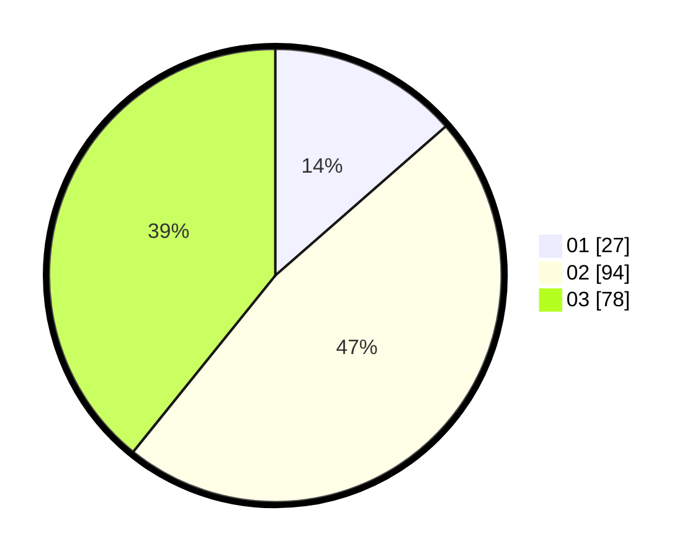

# Hasil

Hasil perolehan suara paslon dapat dilihat pada file paslon-01.txt, paslon-02.txt, dan paslon-03.txt.

Jika tidak ada, artinya data tersebut belum ada pada SIREKAP.

## Perolehan Suara

 * Paslon 01: **27**.
 * Paslon 02: **94**.
 * Paslon 03: **78**.

## Foto C Plano

https://sirekap-obj-formc.kpu.go.id/9cc7/pemilu/ppwp/31/71/02/10/01/3171021001035-20240215-092242--eb36c1ba-ef29-4757-8c45-c697499cd5ba.jpg

https://sirekap-obj-formc.kpu.go.id/9cc7/pemilu/ppwp/31/71/02/10/01/3171021001035-20240215-092303--12b9a8f4-92fd-41c3-8bb9-891cd24588a6.jpg

https://sirekap-obj-formc.kpu.go.id/9cc7/pemilu/ppwp/31/71/02/10/01/3171021001035-20240215-092252--0c59b922-d2de-46a3-b1c8-91d366debb60.jpg

## DATA PEMILIH TETAP

Jumlah pemilih dalam DPT: **193**.
 * L: **90**.
 * P: **103**.

## DATA PENGGUNA HAK PILIH

Jumlah pengguna hak pilih dalam DPT: **193**.
 * L: **90**.
 * P: **103**.

Jumlah pengguna hak pilih dalam DPTb: **8**.
 * L: **5**.
 * P: **3**.

Jumlah pengguna hak pilih dalam DPK: **1**.
 * L: **0**.
 * P: **1**.

Jumlah pengguna hak pilih: **202**.
 * L: **95**.
 * P: **107**.

## JUMLAH SUARA SAH DAN TIDAK SAH

JUMLAH SELURUH SUARA SAH: **199**.

JUMLAH SUARA TIDAK SAH: **3**.

JUMLAH SELURUH SUARA SAH DAN SUARA TIDAK SAH: **202**.
