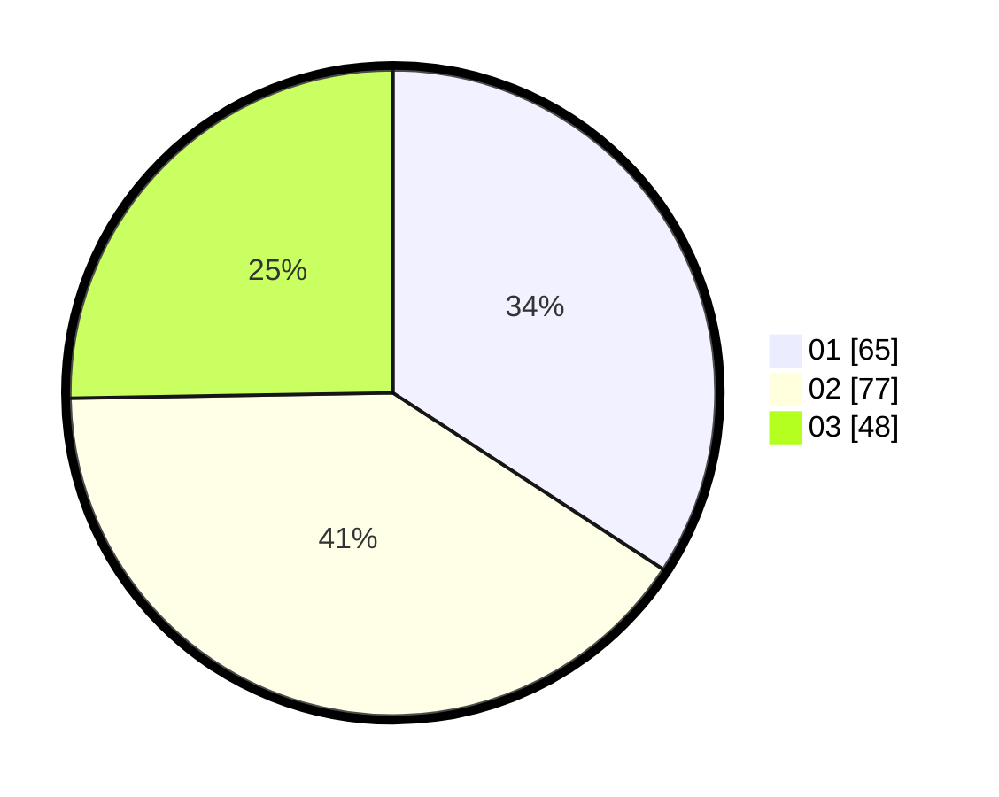

# Hasil

Hasil perolehan suara paslon dapat dilihat pada file paslon-01.txt, paslon-02.txt, dan paslon-03.txt.

Jika tidak ada, artinya data tersebut belum ada pada SIREKAP.

## Perolehan Suara

 * Paslon 01: **65**.
 * Paslon 02: **77**.
 * Paslon 03: **48**.

## Foto C Plano

https://sirekap-obj-formc.kpu.go.id/47c2/pemilu/ppwp/31/71/02/10/01/3171021001037-20240216-141104--2c73cb6a-deeb-419c-b3e5-f205e8d3d510.jpg

https://sirekap-obj-formc.kpu.go.id/47c2/pemilu/ppwp/31/71/02/10/01/3171021001037-20240216-141105--b814027b-4252-48b4-b9d3-57fb160eb31f.jpg

https://sirekap-obj-formc.kpu.go.id/47c2/pemilu/ppwp/31/71/02/10/01/3171021001037-20240216-141105--69a1d0aa-d5fc-454c-aa8c-c7d18b051c0d.jpg

## DATA PEMILIH TETAP

Jumlah pemilih dalam DPT: **276**.
 * L: **137**.
 * P: **139**.

## DATA PENGGUNA HAK PILIH

Jumlah pengguna hak pilih dalam DPT: **181**.
 * L: **86**.
 * P: **95**.

Jumlah pengguna hak pilih dalam DPTb: **10**.
 * L: **8**.
 * P: **2**.

Jumlah pengguna hak pilih dalam DPK: **2**.
 * L: **2**.
 * P: **0**.

Jumlah pengguna hak pilih: **193**.
 * L: **96**.
 * P: **97**.

## JUMLAH SUARA SAH DAN TIDAK SAH

JUMLAH SELURUH SUARA SAH: **190**.

JUMLAH SUARA TIDAK SAH: **3**.

JUMLAH SELURUH SUARA SAH DAN SUARA TIDAK SAH: **193**.
