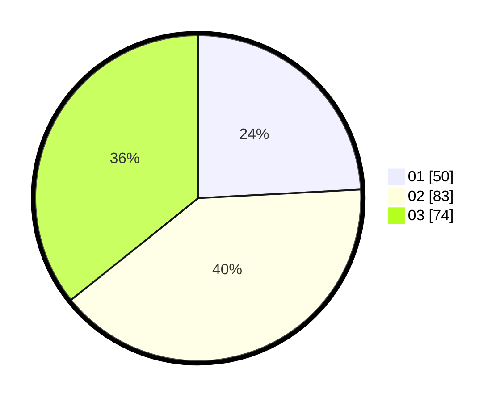

# Hasil

Hasil perolehan suara paslon dapat dilihat pada file paslon-01.txt, paslon-02.txt, dan paslon-03.txt.

Jika tidak ada, artinya data tersebut belum ada pada SIREKAP.

## Perolehan Suara

 * Paslon 01: **50**.
 * Paslon 02: **83**.
 * Paslon 03: **74**.

## Foto C Plano

https://sirekap-obj-formc.kpu.go.id/e738/pemilu/ppwp/31/71/02/10/01/3171021001038-20240216-024340--fc8f5825-e7ef-42b4-ac70-47c51dba6cdd.jpg

https://sirekap-obj-formc.kpu.go.id/e738/pemilu/ppwp/31/71/02/10/01/3171021001038-20240216-024357--477f6e29-9b52-45aa-b3a3-ce4765752f90.jpg

https://sirekap-obj-formc.kpu.go.id/e738/pemilu/ppwp/31/71/02/10/01/3171021001038-20240216-025806--4000d745-7e30-443f-974c-24aab1e79865.jpg

## DATA PEMILIH TETAP

Jumlah pemilih dalam DPT: **284**.
 * L: **143**.
 * P: **141**.

## DATA PENGGUNA HAK PILIH

Jumlah pengguna hak pilih dalam DPT: **195**.
 * L: **91**.
 * P: **104**.

Jumlah pengguna hak pilih dalam DPTb: **9**.
 * L: **6**.
 * P: **3**.

Jumlah pengguna hak pilih dalam DPK: **3**.
 * L: **1**.
 * P: **2**.

Jumlah pengguna hak pilih: **207**.
 * L: **98**.
 * P: **109**.

## JUMLAH SUARA SAH DAN TIDAK SAH

JUMLAH SELURUH SUARA SAH: **207**.

JUMLAH SUARA TIDAK SAH: **0**.

JUMLAH SELURUH SUARA SAH DAN SUARA TIDAK SAH: **207**.
