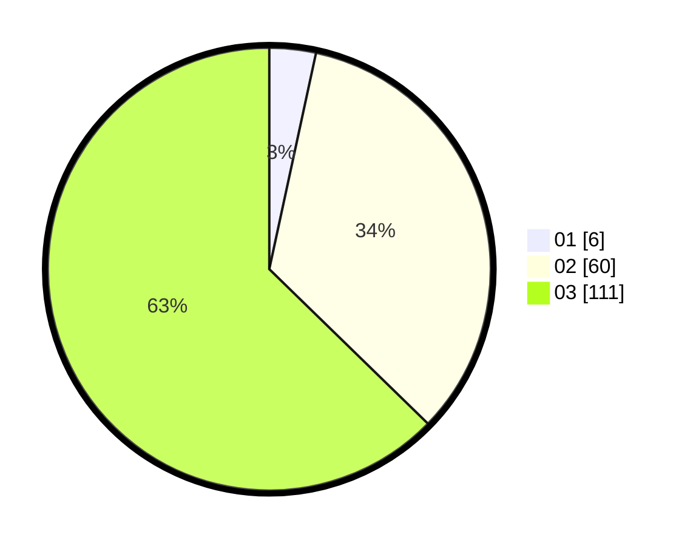

# Hasil

Hasil perolehan suara paslon dapat dilihat pada file paslon-01.txt, paslon-02.txt, dan paslon-03.txt.

Jika tidak ada, artinya data tersebut belum ada pada SIREKAP.

## Perolehan Suara

 * Paslon 01: **6**.
 * Paslon 02: **60**.
 * Paslon 03: **111**.

## Foto C Plano

https://sirekap-obj-formc.kpu.go.id/2d2d/pemilu/ppwp/31/71/02/10/01/3171021001041-20240217-163730--340d2953-6ad4-4499-b272-7f461d382ba2.jpg

https://sirekap-obj-formc.kpu.go.id/2d2d/pemilu/ppwp/31/71/02/10/01/3171021001041-20240218-114337--fd6f87ac-5b2b-4373-911c-7962e2e538ac.jpg

https://sirekap-obj-formc.kpu.go.id/2d2d/pemilu/ppwp/31/71/02/10/01/3171021001041-20240218-114626--a46b4749-afa1-4926-adee-76da236bdd1e.jpg
