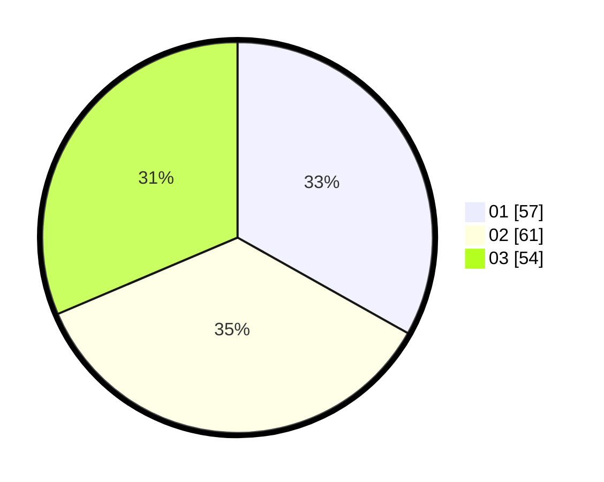

# Hasil

Hasil perolehan suara paslon dapat dilihat pada file paslon-01.txt, paslon-02.txt, dan paslon-03.txt.

Jika tidak ada, artinya data tersebut belum ada pada SIREKAP.

## Perolehan Suara

 * Paslon 01: **57**.
 * Paslon 02: **61**.
 * Paslon 03: **54**.

## Foto C Plano

https://sirekap-obj-formc.kpu.go.id/d7a5/pemilu/ppwp/31/71/02/10/01/3171021001043-20240215-223307--b1e58403-dbfa-4cda-a7c4-9b8d5fe62562.jpg

https://sirekap-obj-formc.kpu.go.id/d7a5/pemilu/ppwp/31/71/02/10/01/3171021001043-20240215-223308--b76b5d6a-8169-4496-920e-2f9b025d43cc.jpg

https://sirekap-obj-formc.kpu.go.id/d7a5/pemilu/ppwp/31/71/02/10/01/3171021001043-20240215-223307--d9c88692-7aa5-4659-adc2-41acde4deab7.jpg

## DATA PEMILIH TETAP

Jumlah pemilih dalam DPT: **222**.
 * L: **110**.
 * P: **112**.

## DATA PENGGUNA HAK PILIH

Jumlah pengguna hak pilih dalam DPT: **154**.
 * L: **75**.
 * P: **79**.

Jumlah pengguna hak pilih dalam DPTb: **16**.
 * L: **9**.
 * P: **7**.

Jumlah pengguna hak pilih dalam DPK: **2**.
 * L: **0**.
 * P: **2**.

Jumlah pengguna hak pilih: **172**.
 * L: **84**.
 * P: **88**.

## JUMLAH SUARA SAH DAN TIDAK SAH

JUMLAH SELURUH SUARA SAH: **172**.

JUMLAH SUARA TIDAK SAH: **0**.

JUMLAH SELURUH SUARA SAH DAN SUARA TIDAK SAH: **172**.
