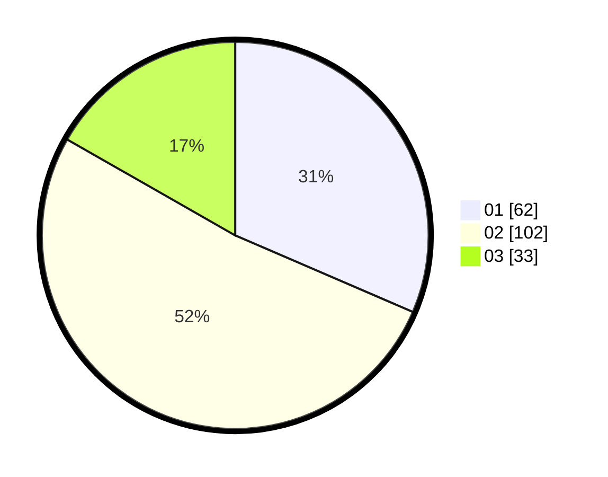

# Hasil

Hasil perolehan suara paslon dapat dilihat pada file paslon-01.txt, paslon-02.txt, dan paslon-03.txt.

Jika tidak ada, artinya data tersebut belum ada pada SIREKAP.

## Perolehan Suara

 * Paslon 01: **62**.
 * Paslon 02: **102**.
 * Paslon 03: **33**.

## Foto C Plano

https://sirekap-obj-formc.kpu.go.id/af17/pemilu/ppwp/31/71/02/10/02/3171021002004-20240216-160248--14574d54-2a4e-4efd-9e98-6807075bb74d.jpg

https://sirekap-obj-formc.kpu.go.id/af17/pemilu/ppwp/31/71/02/10/02/3171021002004-20240216-160249--758b1b76-8a03-46c2-a69a-fc7e3dc8f1f8.jpg

https://sirekap-obj-formc.kpu.go.id/af17/pemilu/ppwp/31/71/02/10/02/3171021002004-20240216-160248--186db104-0f77-4911-ab74-2dfd3c6f5cac.jpg

## DATA PEMILIH TETAP

Jumlah pemilih dalam DPT: **283**.
 * L: **141**.
 * P: **142**.

## DATA PENGGUNA HAK PILIH

Jumlah pengguna hak pilih dalam DPT: **195**.
 * L: **96**.
 * P: **99**.

Jumlah pengguna hak pilih dalam DPTb: **4**.
 * L: **2**.
 * P: **2**.

Jumlah pengguna hak pilih dalam DPK: **0**.
 * L: **0**.
 * P: **0**.

Jumlah pengguna hak pilih: **199**.
 * L: **98**.
 * P: **101**.

## JUMLAH SUARA SAH DAN TIDAK SAH

JUMLAH SELURUH SUARA SAH: **197**.

JUMLAH SUARA TIDAK SAH: **2**.

JUMLAH SELURUH SUARA SAH DAN SUARA TIDAK SAH: **199**.
