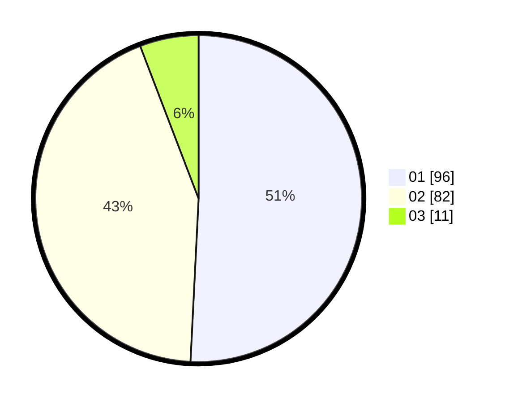

# Hasil

Hasil perolehan suara paslon dapat dilihat pada file paslon-01.txt, paslon-02.txt, dan paslon-03.txt.

Jika tidak ada, artinya data tersebut belum ada pada SIREKAP.

## Perolehan Suara

 * Paslon 01: **96**.
 * Paslon 02: **82**.
 * Paslon 03: **11**.

## Foto C Plano

https://sirekap-obj-formc.kpu.go.id/4648/pemilu/ppwp/31/71/02/10/02/3171021002005-20240216-145607--341631b3-9fd8-4044-a599-84c9abb6e4f0.jpg

https://sirekap-obj-formc.kpu.go.id/4648/pemilu/ppwp/31/71/02/10/02/3171021002005-20240216-145608--433f3d94-3910-481b-b54b-5bbf136ecafa.jpg

https://sirekap-obj-formc.kpu.go.id/4648/pemilu/ppwp/31/71/02/10/02/3171021002005-20240216-145608--907dc84a-a358-4a72-a40a-092ba2cb85c9.jpg

## DATA PEMILIH TETAP

Jumlah pemilih dalam DPT: **287**.
 * L: **141**.
 * P: **146**.

## DATA PENGGUNA HAK PILIH

Jumlah pengguna hak pilih dalam DPT: **193**.
 * L: **94**.
 * P: **99**.

Jumlah pengguna hak pilih dalam DPTb: **2**.
 * L: **0**.
 * P: **2**.

Jumlah pengguna hak pilih dalam DPK: **0**.
 * L: **0**.
 * P: **0**.

Jumlah pengguna hak pilih: **195**.
 * L: **94**.
 * P: **101**.

## JUMLAH SUARA SAH DAN TIDAK SAH

JUMLAH SELURUH SUARA SAH: **189**.

JUMLAH SUARA TIDAK SAH: **6**.

JUMLAH SELURUH SUARA SAH DAN SUARA TIDAK SAH: **195**.
