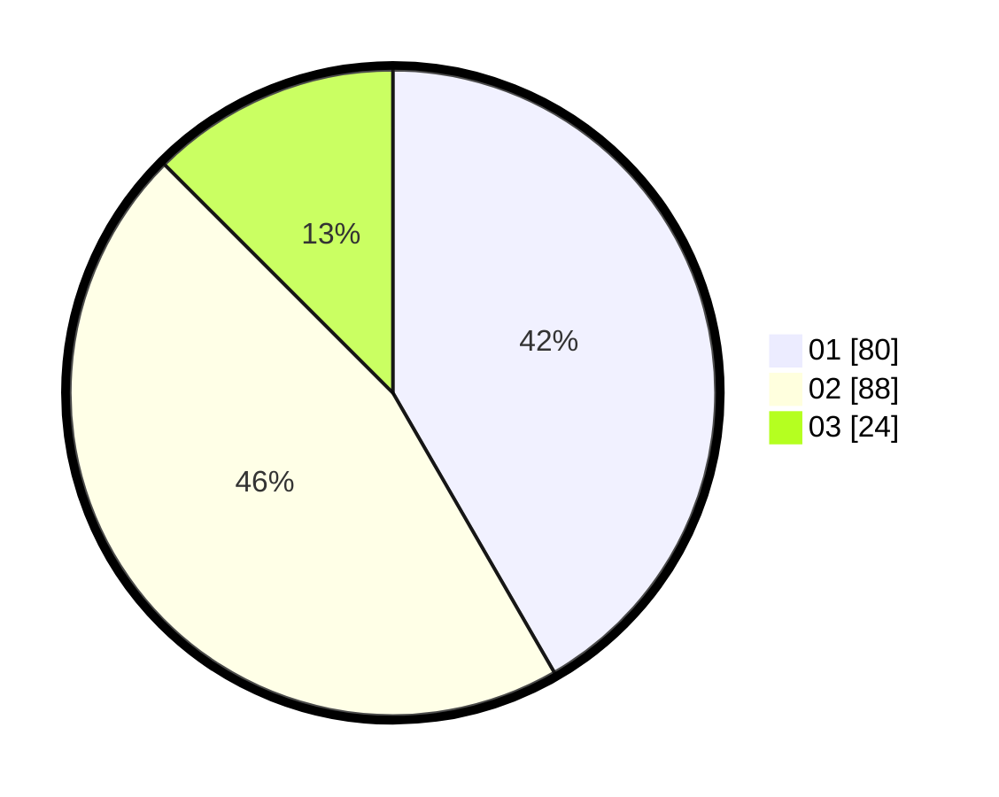

# Hasil

Hasil perolehan suara paslon dapat dilihat pada file paslon-01.txt, paslon-02.txt, dan paslon-03.txt.

Jika tidak ada, artinya data tersebut belum ada pada SIREKAP.

## Perolehan Suara

 * Paslon 01: **80**.
 * Paslon 02: **88**.
 * Paslon 03: **24**.

## Foto C Plano

https://sirekap-obj-formc.kpu.go.id/1444/pemilu/ppwp/31/71/02/10/02/3171021002007-20240216-151643--b97b1fbc-0c02-4e1a-8e7d-84517e9f3b99.jpg

https://sirekap-obj-formc.kpu.go.id/1444/pemilu/ppwp/31/71/02/10/02/3171021002007-20240216-151644--88b032dc-bea9-4e55-9d79-6359db84842c.jpg

https://sirekap-obj-formc.kpu.go.id/1444/pemilu/ppwp/31/71/02/10/02/3171021002007-20240216-151643--51b9f50f-fca7-42e4-92b8-3b4636aff7de.jpg

## DATA PEMILIH TETAP

Jumlah pemilih dalam DPT: **256**.
 * L: **132**.
 * P: **124**.

## DATA PENGGUNA HAK PILIH

Jumlah pengguna hak pilih dalam DPT: **192**.
 * L: **97**.
 * P: **95**.

Jumlah pengguna hak pilih dalam DPTb: **2**.
 * L: **0**.
 * P: **2**.

Jumlah pengguna hak pilih dalam DPK: **1**.
 * L: **0**.
 * P: **1**.

Jumlah pengguna hak pilih: **195**.
 * L: **97**.
 * P: **98**.

## JUMLAH SUARA SAH DAN TIDAK SAH

JUMLAH SELURUH SUARA SAH: **192**.

JUMLAH SUARA TIDAK SAH: **3**.

JUMLAH SELURUH SUARA SAH DAN SUARA TIDAK SAH: **195**.
