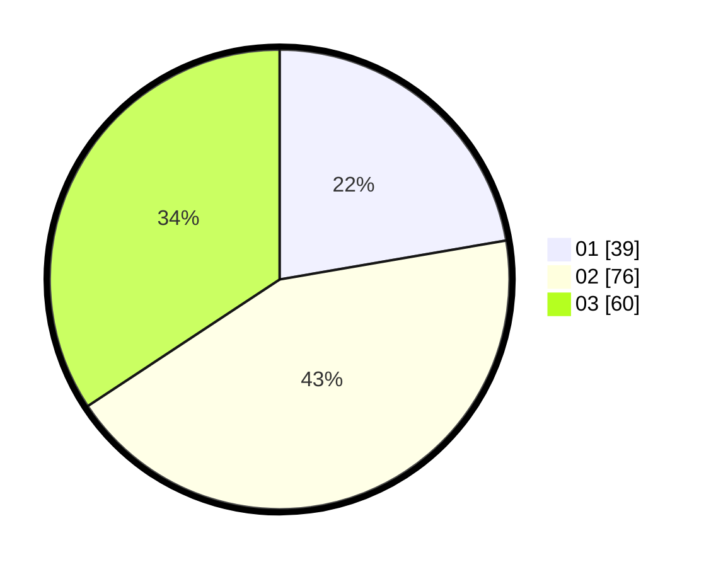

# Hasil

Hasil perolehan suara paslon dapat dilihat pada file paslon-01.txt, paslon-02.txt, dan paslon-03.txt.

Jika tidak ada, artinya data tersebut belum ada pada SIREKAP.

## Perolehan Suara

 * Paslon 01: **39**.
 * Paslon 02: **76**.
 * Paslon 03: **60**.

## Foto C Plano

https://sirekap-obj-formc.kpu.go.id/12f5/pemilu/ppwp/31/71/02/10/02/3171021002008-20240216-211724--59a5d78a-5113-406f-aff2-d1bb72c0be32.jpg

https://sirekap-obj-formc.kpu.go.id/12f5/pemilu/ppwp/31/71/02/10/02/3171021002008-20240216-211725--351cbafd-4509-45f0-bdd0-3ff8f10a12ee.jpg

https://sirekap-obj-formc.kpu.go.id/12f5/pemilu/ppwp/31/71/02/10/02/3171021002008-20240216-211725--5c569e68-ebfa-4cb8-a78e-7025b10482c6.jpg

## DATA PEMILIH TETAP

Jumlah pemilih dalam DPT: **258**.
 * L: **129**.
 * P: **129**.

## DATA PENGGUNA HAK PILIH

Jumlah pengguna hak pilih dalam DPT: **177**.
 * L: **86**.
 * P: **91**.

Jumlah pengguna hak pilih dalam DPTb: **0**.
 * L: **0**.
 * P: **0**.

Jumlah pengguna hak pilih dalam DPK: **0**.
 * L: **0**.
 * P: **0**.

Jumlah pengguna hak pilih: **177**.
 * L: **86**.
 * P: **91**.

## JUMLAH SUARA SAH DAN TIDAK SAH

JUMLAH SELURUH SUARA SAH: **175**.

JUMLAH SUARA TIDAK SAH: **2**.

JUMLAH SELURUH SUARA SAH DAN SUARA TIDAK SAH: **177**.
